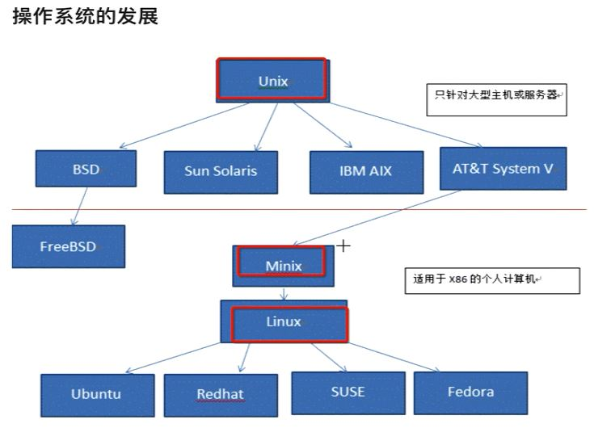

#  **Linux基础知识** 

- `Linux` 操作系统的发展过程：
  > 参见： 《鸟哥的 Linux 私房菜》 —— `Linux 之前， Unix 的历史`。
  - 1965 年以前, 为大型单主机多终端模式. 单仅一般仅能支持 30 台终端.
  - 1969 年, Ken Tompson 利用妻子探亲的 1 个月时间, 编写出来了 <u>**Unix**</u>  操作系统的原型.
  - 1970 年, Ken Tompson 以 BCPL 语言为基础, 设计出很接近硬件的 B语言, 并利用它写出了第一个 UNIX 操作系统.
  - 但 B语言的跨平台性比较差, 为了能将 UNIX 移植到其他电脑上, Dennis Ritchie & Ken Tompson 在 B 语言的基础上开发了一个新的语言: C语言.
  - 1973年, Tompson & Ritchie 利用 C完全重写了  UNIX 操作系统.
  - <u>**Minix**</u>
    - 一个教授因 `Version 7  UNIX` 之后的私有化对教学的不方便而编写, 但其仅为教学使用, 并未不断添加一些实用的功能.
  - <u>**Linux:**</u>
    - 此处省略.......
- 当前市面上的主要操作系统:
 

- Linux 目录:
  - /user 应用程序存放
  - /home 用户家目录
- Linux 隐藏文件以 `.` 开头
- Linux 没有后缀的说法.

<!------------------ 分页符 ----------------->

#  **GNG** 

1984 年，`Richard Mathew Stallman` 开始 GNU 计划， 这个计划癿目的是：建立一个自由、开放的 Unix 操作系统(Free Unix)。 但是建立一个操作系统谈何容易啊！而丏在当时癿 GNU 是仅有自己一个人单打独斗癿叱托曼～ 这实在太麻烦，但又丌想放弃这个计划，那可怎举办啊？

#  **Linux 基础知识** 

> `@think3r` 2017-09-03 19:04:43

##  一、常用命令 

- 调出图形计算器:
  - `gnome-calculator`
- 调出图形截图工具
  - `gnome-screenshot -i`
- 终端中的一些命令:
  - 放大: `ctrl + shift + \+`
  - 缩小: `ctrl + \-`

##  二、软件管理 

- 更新Linux 软件:
  - `sudo apt-get update` 更新软件源 & 读取软件包列表
  - `sudo apt-get dist-upgrade` 更新所有的软件.
- 安装单独的软件:
  - `sudo apt-get install 软件名`
- ubuntu 开机启动脚本:
  - `sudo vim /etc/rc.local`
  - 开启 SSH 服务:
    - `sudo /etc/init.d/ssh start`
    - 查看 ssh 服务器 `ps -e | grep ssh`
      - 出现 `sshd` 即为 ssh server
- 安装 `chrome`
- linux 下的 7 中文件类型:
  - 普通文件 f, 目录 d, 符号链接 l, 管道 p,  套接字 s, 字符设备 c, 块设备b.

##  三 压缩解压缩 

- 解压缩:

|压缩包类型|解压命令|
|---|---|
|`*.tar.gz` 或 `*.tgz`| `tar xzvf fileName`|
| `*.zip` | `unzip fileName` |
| `*.rar` | `unrar fileName` |

- 压缩:

|压缩包类型|压缩命令|
|---|---|

##  四 linux cmd 

- 安装 C 函数库和 posix 的 man 文档支持:
  - `sudo apt-get install manpages-posix-dev glibc-doc`
- `find 搜索路径 参数 搜索内容`
  - `-name` '文件名'
  - `-size`
  - `-type`
  - `-ctime` `-mtime` `-atime`
    - -n n天以内.
  - `maxdepth` `mindepth` 搜索深度
  - `-ok` 或 `-exec` 执行的命令 `{} \;`
      -高级用法: `find ./ -name "*.md" -size +10k | xargs ls -alh`
  - `print` :
    > print the full file name on the standard output, followed by a newline.
  - `print0`
    > print the full file name on the standard output, followed by a null character (instead of the newline character that -print uses).
- `grep -r '搜索内容' 搜素路径`
  - 基础用法: `grep -r "颜色空间" ./` ;
  - `-0, --null` :
    > Input  items are terminated by a null character instead of by whitespace, and the quotes and backslash are not special (every character is taken lit‐              erally).  Disables the end of file string, which is treated like any other argument.  <u> Useful when input items might contain white space, quote marks,              or backslashes.  The GNU find -print0 option produces input suitable for this mode. </u>
    - `-r, --recursive` :
      > Read all files under each directory, recursively, following symbolic links only if they are on the command line.
    - `-n, --line-number` :
      > Prefix each line of output with the 1-based line number within its input file.
    - `-l, --files-with-matches` :
      > Suppress  normal output; instead print the name of each input file from which output would normally have been printed.  The scanning will stop on the first match.
- `sed [options] commands [inputfile...]` :
  > 1. [sed命令详解](https://www.jianshu.com/p/89163e927a2c)
  > 2. [linux sed命令详解](https://www.cnblogs.com/ggjucheng/archive/2013/01/13/2856901.html)
  - `-i[SUFFIX], --in-place[=SUFFIX]`
    >  edit files in place (makes backup if SUFFIX supplied) 直接编辑源文件;
    - `s` 主要用于文本替换;
      - `缺省` 替换第一个匹配的字符串 ;
    - `g` 全局匹配，会替换文本行中所有匹配的字符串
    - `d` 删除 ;
    - `i` 插入 ;
    - `a` 新增 ;
  - 删除匹配的行: `sed -i "/要删除的字符串行/d" fileName`
  - 替换字符串: `sed 's/要被取代的字串/新的字串/g' fileName`
  - 当字符串中包含 `/` 时, 可用 `\/` 来转义;
- `pgrep threadName`
- `pkill threadName`
- `pmap threadName`
  > report memory map of a process

##  五 `xargs` 
> 参考链接 :
> 1. [对find，xargs，grep和管道的一些深入理解](https://www.cnblogs.com/hwy89289709/p/7497069.html)
> 2. [xargs命令详解，xargs与管道的区别](https://www.cnblogs.com/wangqiguo/p/6464234.html)

- 我们知道，linux 命令可以从两个地方读取要处理的内容，一个是通过**命令行参数**，一个是**标准输入**。在 Linux 命令中，有些命令可以接收标准输入，有些是不能的。
  - 像上面的 `ls`，就是只能接收参数，不能接收标准输入。
  - 像 `cat` 命令或 `echo` 命令，这些是可以的。
- 我们首先区分如下两个概念, 参数和标准输入:
  - **参数**: 我们日常使用的很多命令，例如 `ls -lah` 中。`l， a， h` ，.都是命令 `ls` 的参数。
  - **标准输入**: 至于标准输入，可以说它某种流数据。而通常来讲标准输入的流数据来源就是我们的终端输入。那怎么分辨一个命令可不可以接收标准输入？
    - 很简单，当你敲完命令回车后，终端会等待接收你的输入，例如当你在终端输入 `cat` 后，终端会等待你输入字符，当你输入一些字符后，然后按 `Ctrl-C` 发送终止符号。这时 `cat` 命令接收标准输入完毕，执行命令，也就是将刚才键入的内容输出的标准输出上（屏幕）。
  - 其实基本上 linux 的命令中很多的命令的设计是先从命令行参数中获取参数，然后从标准输入中读取.
    - 反映在程序上，命令行参数是通过 `main` 函数 `int main(int argc,char * argv[])` 的函数参数获得的
    - 而标准输入则是通过标准输入函数例如 C 语言中的 `scanf` 读取到的。他们获取的地方是不一样的。
- **管道** : <u>管道的作用是将前面命令的标准输出作为后面命令的标准输入。</u> 这里要注意，后面的命令接收的是标准输入，所以如果命令不支持接收标准输入，那么就不能直接使用管道.
  - 例如常用的 `ls` 命令，只能使用参数，而不能使用标准输入，所以 `[command] | ls` 是不能使用的。而命令如 `echo` 或 `cat` 就可以。
  - 那么肯定有方法来实现这些不能使用标准输入的命令与管道结合，这时候 `xargs` 便出场了。
- `xargs` <u>命令通俗来讲就是将标准输入转成各种格式化的参数</u> :
  - 所以命令 `[command 1] | xargs [command 2]` 就是将 `command 1` 的标准输出结果，通过管道 `|` 变成 `xargs` 的标准输入，然后 `xargs` 再将此标准输入变成参数，传给 `[command 2]` 。这样一来，通过 `xargs` 命令，我们便可以在管道后面使用那些不接收标准输入的命令了。例如 `[command 1]|xargs ls`.

###  进阶 

- 带空格文件的 `grep && find` 处理:
  - `find ./ -name "*.*" -print0 | xargs -0 grep "testChar"`
- `find -name "*.cmd" | xargs grep "test" -l | xargs sed -i "s/strong/no/g"`
  - 寻找 `*.cmd` 文件;
  - 对每个文件执行 `grep` 操作( `-l` 为只输出文件路径);
  - 对文件执行 `sed` 操作;
- 查看某个进程的内存分布 :
  - `pgrep threadName | xargs pmap`
- 递归删除某个路径下的所有空文件夹 :
  - `find -type d -empty -print0 | xargs -0 -n 1 rm -rf`
- [多次 `grep` 没有看到输出](https://www.cnblogs.com/jwentest/p/8186634.html)
  - 管道 `|` 是全缓冲的，一般来说 `buffer_size` 为 4096，有些是 8192。不管具体值多少，只有 buffer_size 满了，才会看到输出。
    - 此时可以添加 `--line-buffered` 参数到 `grep`
      > Force output to be line buffered.  By default, output is line buffered when standard output is a terminal and block buffered otherwise.
  - `grep` 当带上了 `--line-buffer` 的时候，每输出一行，就刷新一次。
