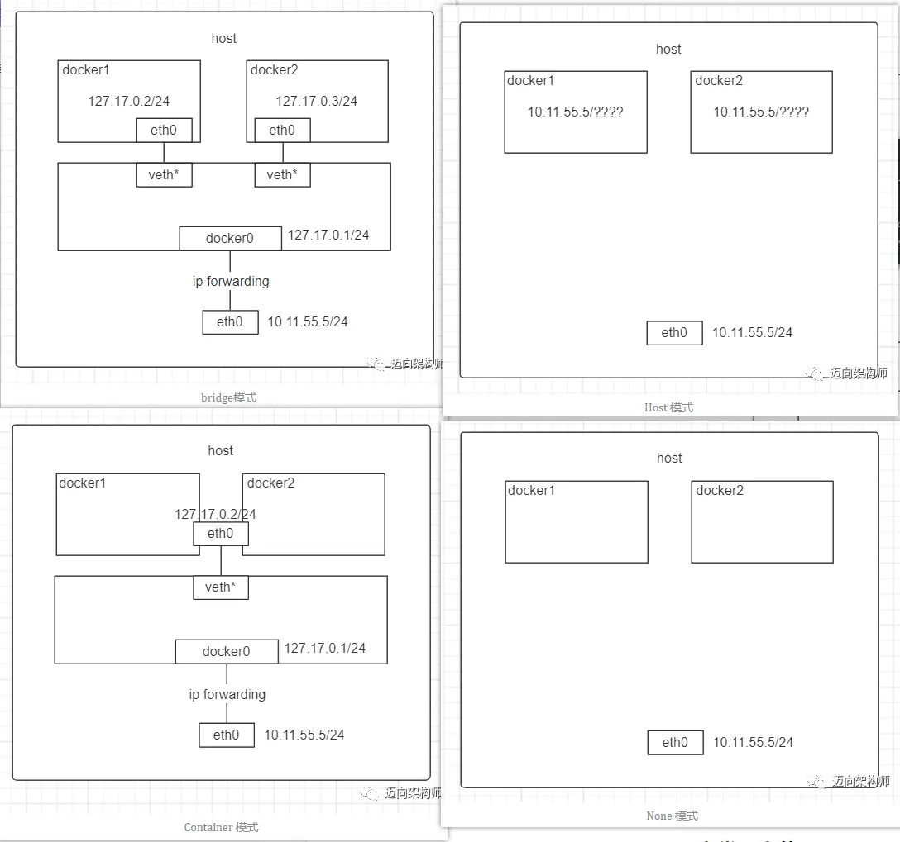
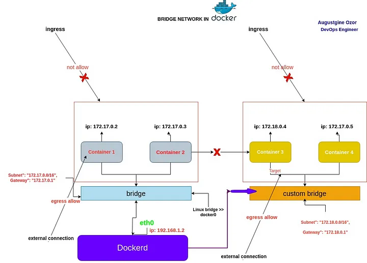

# <font color=#0099ff> **docker 实战** </font>

## <font color=#009A000> 0x00  docker 命令 </font>

1. `docker info` : 查看 docker 的基本信息
2. 配置 docker 阿里云镜像 :
   1. `~/.docker/daemon.json` 中加入 `"registry-mirrors": ["https://xxxx.mirror.aliyuncs.com"]`
   2. docker for Desktop 中修改配置
3. `docker run` 相关 :
   1. `-d` : detach, Run container in background and print container ID (后台运行容器，并返回容器ID)
      - 其后可接 image 名称
      - 容器会独立于你的终端运行，不会占用当前的命令行界面，你可以继续在该终端执行其他命令或关闭终端窗口，而容器仍然会在后台持续运行
   2. `-i` (--interactive): 以交互模式运行容器，通常与 `-t` 同时使用
      - 可以让你与容器保持交互，只保持了 `STDIN` 的打开状态，但是没有分配 TTY, 也不会模拟一个终端 (没有高亮等)
      - 需要向容器发送输入，但不需要终端交互, E.g. : `echo "Hello" | docker run -i alpine cat`
   3. `-t` : 为容器重新分配一个伪输入终端，通常与 `-i` 同时使用 `-it`
      - `-dit`
        - 在后台创建一个 tty, 当前终端可继续执行其它命令并可关闭窗口
        - 这使得如果你稍后想要连接到这个容器并与其交互，可以使用 `docker exec -it <container_id_or_name> /bin/sh` 或者 `docker attach <container_id_or_name>` 命令来附加到容器上，并获得一个交互式的 shell 环境
   4. `-p` : 指定端口映射，格式为：`主机(宿主)端口:容器端口`
   5. `--name="nginx-lb"` : 为容器指定一个名称
   6. `-rm` : 运行结束后删除
4. `docker ps` : 查看正在运行的容器
   - `-a` 查看所有(终止)状态的容器
   - `-q` 查看对应的 container ID
5. docker 的生命周期 :
   
   1. `docker create` : `created`, 初建状态
   2. `docker run` : `running` / `Up`, 运行状态
      - `docker start` ： 容器转为运行状态；
   3. `docker stop` : `stopped` / `exited`, 停止状态
   4. `docker pause ：` paused, 停状态
   5. `docker unpause` ： 取消暂停状态，容器进入运行状态；
   6. `docker kill` : 容器在故障（死机）时，执行 kill（断电），容器转入停止状态，这种操作容易丢失数据，除非必要，否则不建议使用；
   7. `docker rm -f xxx` : deleted：删除状态
   8. `dead` : 死亡
6. 进入正在运行的 container 的两种方法 :
   1. `docker exec -it containerId /bin/bash` : 进入正在运行的容器并开启一个新的终端
   2. `docker attach containerId` : 进入容器正在执行的终端，不会启动新的进程
      - 如果使用 `exit` 退出，容器会停止运行！
      - 如果想退出容器但不想容器停止，则按住 `Ctrl+P+Q` 退出
7. docker 文件/存储相关 :
   1. `docker cp 本地路径 容器id或者容器名字:容器内路径` : 本地到服务器
8. docker 生成自定义镜像(修改启动命令)的方式 :
   1. Dockerfile 的方式修改命令 :

      ```Dockerfile
      FROM image:demo  #要改动命令的镜像
      WORKDIR /root/  #执行命令的工作目录路径
      CMD ["python","main.py"] # 要更改的命令
      ```

   2. 直接通过 commit 修改 : `docker commit --change="WORKDIR /" -c 'CMD [ "bash" ]'  -m "基础ubuntu镜像" -a 'think3r' 639b37671e5c  outImage:v1`
      1. `–change` : Apply Dockerfile instruction to the created image (可以写入 dockerfile 的语法语句)
      2. `-c` : Apply Dockerfile instruction to the created image(可以写入启动命令)
      3. `-m` : --message string, Commit message
9. 导入和导出
   1. 容器 :
      1. 导出 : `docker export 1e560fca3906 > ubuntu.tar`
      2. 导入 : `cat docker/ubuntu.tar | docker import - test/ubuntu:v1`
   2. 镜像 :
      1. 导出 `docker save 0fdf2b4c26d3 > hangge_server.tar`
      2. 导入 `docker load < hangge_server.tar`
10. debug :
    1. `docker inspect` 检索有关 Docker 对象（例如容器、镜像、卷和网络）的底层信息

### <font color=#FF4500> docker file </font>

- <../config/Dockerfile>

## <font color=#009A000> 0x01 常用 docker 命令 </font>

> [Docker 命令大全](https://www.runoob.com/docker/docker-command-manual.html)

```sh
# docker 操作命令
apt-get update && apt-get upgrade
apt-get install ca-certificates # 更新 ca 证书
# 更改为清华源
apt-get install vim-tiny tree file zsh inetutils-ping
# git clone 拷贝 oh-my-zsh 及其插件

# dockerhub 等的凭证相关
sudo cat /root/.docker/config.json  # 凭证存储位置
echo "xxxx" | base64 --decode       # 密钥解码
sudo docker login --username=aliyunxxxx registry.cn-hangzhou.aliyuncs.com  # 登录

# 镜像相关
docker images -a  # 列出所有镜像
docker rmi xxx:xxx  # 删除指定镜像
docker tag <image-name:tag> <username>/<repository>:<tag>  # 将本地构建的镜像与仓库中的镜像进行关联
docker push <username>/<repository>:<tag>   # 将标记的镜像推送到 Docker 镜像仓库中
docker pull registry.cn-hangzhou.aliyuncs.com/think3r/ubuntu_base:v2 # 拉取远端镜像
docker search hello  # 搜索 hello 相关的镜像
docker-squash --tag my-github-pages:latest my-github-pages # 优化生成镜像的大小

# 构建
docker build -t test-alpine . -f ./DockerfileAlpine   # 构建镜像
docker-squash --tag test-alpine:latest test-alpine    # 删除镜像标签以减少体积占用

# 容器相关
docker ps -a   # 查看当前所有容器的状态
docker rm -f xxx # 删除指定容器
docker container prune  #清理系统中处于停止状态的容器, 释放磁盘空间

# 运行相关
docker run [--rm] -it xxx  imageId
docker start -ai  containerId  # 进入已经停止的容器
docker exec -it 5be /bin/zsh   # 重新开一个已经停止的容器

# 清理
docker system           # 查看 docker 磁盘占用
docker builder du       # 查看 docker 构建缓存
docker builder prune    # 清理构建缓存
```

### <font color=#FF4500> docker 网络 </font>

> 1. [Docker网络虚拟化实现原理（Bridge模式）](https://zhuanlan.zhihu.com/p/398812144)
> 2. [一文读懂Docker网络基础-虚拟网络设备对（veth）原理](https://zhuanlan.zhihu.com/p/493856103)
> 3. [Understanding Docker Bridge Network](https://medium.com/@augustineozor/understanding-docker-bridge-network-6e499da50f65)

<br/> 

<br/> 

- bridge 模式 (**默认**)
  - 当 Docker 进程启动时，会在主机上创建一个名为 `docker0` 的 '虚拟网桥' (虚拟的三层交换机)
    - 二层交换: 在连接到 docker0 的容器之间，docker0 实现了二层数据帧的交换，确保同一子网内的容器可以快速通信。
    - 三层路由: docker0 也具备路由功能，它作为容器的默认网关，负责将容器发往外部网络的数据包路由到宿主机，并进行后续的 NAT 处理。 这部分体现了三层路由的功能。
    - IP 地址和子网: docker0 拥有 IP 地址，并管理一个容器子网，这都是三层网络设备（如路由器、三层交换机）的典型特征。
  - `docker0` 也作为容器的默认网关, 每个容器分配独立的网络命名空间和 IP 地址，容器之间通过网桥互联，并通过 NAT 与宿主机及外部网络通信
    - 不写 `–net` 参数，默认就是 bridge 模式。使用 `docker run -p` 时，docker 实际是在 `iptables` 做了 `DNAT` 规则，实现端口转发功能。可以使用 `iptables -t nat -vnL` 查看
    - 缺点 : NAT 转发带来轻微性能损耗；需手动管理端口映射
  - 但是容器之间是隔离的, 适用于单个宿主机内的容器间通信
  - 外部主机通常无法直接通过容器的内部 IP 地址 ping 通容器, 一个是网络隔离, 一个则是 NAT 隔离.

   ```sh
   # 新建一个网络
   $ docker network create -d bridge my-net

   # 运行一个容器并连接到新建的 my-net 网络
   $ docker run -it --rm --name busybox1 --network my-net busybox sh

   # 加入系统网络的应用，可以互相 ping 通，如我可以在其他加入了 my-net 的容器里：
   $ ping busybox
   > PING busybox (172.19.0.2): 56 data bytes
   > 64 bytes from 172.19.0.2: seq=0 ttl=64 time=0.064 ms
   ```

- Host 模式
  - 容器直接使用宿主机的网络命名空间(和宿主机共用一个 `Network Namespace`)，与宿主机共享 IP 地址和端口，没有独立的网络栈
  - E.g. : `docker run -tid --net=host --name docker_host1 ubuntu-base:v3`
  - 使用场景 :
    - 需要容器网络性能接近宿主机原生性能（如高频网络传输）。
    - 容器需直接暴露大量端口，避免繁琐的端口映射
- None 模式 :
  - 容器拥有独立的网络命名空间，但不配置任何网络接口（无网卡、IP、路由）
    - 用户需手动配置自定义网络（例如通过 ip 命令）
  - E.g. : `docker run --network none`
- Container 模式 :
  - 这个模式指定新创建的容器和已经存在的一个容器共享一个 Network Namespace，而不是和宿主机共享
    - 新容器共享指定容器的网络命名空间，两者使用相同的 IP 地址、端口和网络栈。
  - 多个容器需紧密协作（如日志收集容器与业务容器共享网络）。

   ```sh
   # 示例，独立的 docker_bri1 网络：
   $ docker run -tid --net=container:docker_bri1 \
         --name docker_con1 ubuntu-base:v3
   ```

## <font color=#009A000> 0x02 docker Compose </font>

Docker Compose 是一个用于定义和运行 **多容器** Docker 应用的工具。通过 Docker Compose，用户可以使用 YAML 文件来定义应用服务、网络和卷等配置，然后用单一的命令启动所有服务。它让管理多个容器变得更加简单和高效，特别是对于复杂的应用，像是有数据库、前端和后端等多个组件的场景。

- 使用 Dockerfile 定义应用程序的环境。
- 使用 docker-compose.yml 定义构成应用程序的服务，这样它们可以在隔离环境中一起运行。
- 最后，执行 docker-compose up 命令来启动并运行整个应用程序。

## <font color=#009A000> 0x03 `E.g.`  </font>

### <font color=#FF4500> docker github-pages 本地构建预览 </font>

- [使用Jekyll的docker在本地部署GitHub Pages](https://rz1970.github.io/2018/12/06/deploy-github-pages-locally.html)
- [Building GitHub Pages using Docker](https://avcu.github.io/programming/building-github-pages-using-docker/)
- <https://github.com/soulteary/docker-quick-docs>
- <https://github.com/github/pages-gem>
- <https://github.com/Starefossen/docker-github-pages>

```sh
#镜像构建
docker build -t my-github-pages .

# github-pages 本地预览
docker run \
  --rm \
  --name jekyll \
  -e PAGES_REPO_NWO=th1nk3r-ing/Linux_learn \
  -e JEKYLL_THEME=my-hacker \
  -e JEKYLL_ENV=development \
  -p 4000:4000 \
  -v "./:/srv/jekyll" \
  --tty \
  my-github-pages \
  jekyll serve --watch --force_polling --host 0.0.0.0 --config _config.yml
```

### <font color=#FF4500> docker AI </font>

GPU :

- > Currently GPU support in Docker Desktop is only available on Windows with the WSL2 backend.
- `docker run --rm -it --gpus=all nvcr.io/nvidia/k8s/cuda-sample:nbody nbody -gpu -benchmark`

```sh
# docker 运行 qwen 2.5 模型
docker run --gpus all -v /mnt/i/aiModels/qwen2.5:/models ghcr.io/ggerganov/llama.cpp:light-cuda-b4524 \
  -m /models/qwen2.5-coder-7b-instruct-q4_k_m.gguf \
  -p "You are a helpful coding assistant." \
  -n 512 --n-gpu-layers 9999
```

### <font color=#FF4500> 流媒体 </font>

- [使用docke-compose 搭建流媒体服务](https://blog.csdn.net/weixin_38434780/article/details/143849530)
- [基于docker搭建nginx+rtmp+hls(ffmpeg)直播服务](https://92it.top/?p=1384)
- <https://github.com/tiangolo/nginx-rtmp-docker>
- docker rtmp/hls 推流测试
- ZLToolKit

## <font color=#009A000> 0xFF TODO: </font>
