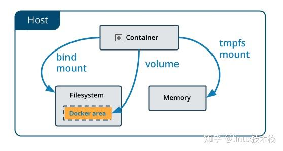

# <font color=#0099ff> **docker 学习笔记** </font>

> `@think3r` 2023-06-19 19:09:16
>
> 1. [全面的 Docker 快速入门教程](https://zhuanlan.zhihu.com/p/435605760)
> 2. [Docker for Mac 的网络问题及解决办法（新增方法四）](https://www.haoyizebo.com/posts/fd0b9bd8/)
> 3. [菜鸟教程 -- Docker 教程](https://www.runoob.com/docker/docker-tutorial.html)
> 4. [如何制作Docker镜像（image）？](https://zhuanlan.zhihu.com/p/122380334)
> 5. [突破 DockerHub 限制，全镜像加速服务](https://zhuanlan.zhihu.com/p/256359308)
> 6. [DockerHub 里面有哪些好用的镜像?](https://www.zhihu.com/question/426345980)
> 7. [Docker 命令大全 - runoob](https://www.runoob.com/docker/docker-command-manual.html)
> 8. [macos 中 docker 的存储路径问题](https://www.cnblogs.com/robinunix/p/12795456.html)
> 9. [如何通俗解释Docker是什么？](https://www.zhihu.com/question/28300645/answer/585166942)
> 10. [docker-osx](https://github.com/sickcodes/Docker-OSX?tab=readme-ov-file)
> 11. [docker真的好难用啊，为什么说它移植性好啊？](https://www.zhihu.com/question/400400231/answer/2784810649?utm_psn=1872242542193561600)

Docker 是一个开源的应用容器引擎，基于 Golang 语言开发，可以让开发者打包他们的应用以及依赖包到一个轻量级、可移植的容器中，然后发布到任何流行的 Linux 服务器。容器是一个沙箱机制，相互之间不会有影响（类似于我们手机上运行的 app），并且容器开销是很低的。

Docker 是一个供开发人员和系统管理员构建、运行和与容器共享应用程序的平台。使用容器部署应用程序称为容器化。容器并不是新事物，但它们用于轻松部署应用程序却是新鲜的。

<u>注意：Docker 并非是一个通用的容器工具，**它依赖于已存在并运行的 Linux 内核环境。**</u>

Docker 的优势 :

- 灵活性：即使是最复杂的应用程序也可以容器化。
- 轻量级：容器利用并共享主机内核，使它们在系统资源方面比虚拟机更有效率。
- 可移植：您可以在本地构建，部署到云上，并在任何地方运行。
- 松耦合：容器是高度自给自足和封装的，允许您在不影响其他容器的情况下替换或升级其中一个。
- 扩展 ：您可以跨数据中心增加和自动分发容器副本。
- 安全性：容器对进程应用主动约束和隔离，而不需要用户进行任何配置。

**<u>Docker 的出现主要就是为了解决：在我的机器上运行时是正常的，但为什么到你的机器上就运行不正常了。</u>**

## <font color=#009A000> 0x00 基本概念 </font>

docker 中有这样几个概念 ：

- `DockerFile` : image 的源代码 (docker 可看做编译器)
- `Image` : 镜像(docker 的可执行程序), 一个'虚拟机'的快照.
  - 操作系统分为内核和用户空间。对于 Linux 而言，内核启动后，会挂载 root 文件系统为其提供用户空间支持。
  - 而 Docker 镜像（Image），就相当于是一个 root 文件系统。
  - Docker 镜像是一个特殊的文件系统，除了提供容器运行时所需的程序、库、资源、配置等文件外，还包含了一些为运行时准备的一些配置参数（如匿名卷、环境变量、用户等）。
  - 镜像不包含任何动态数据，其内容在构建之后也不会被改变。
- `Container` : image 运行之后的进程 (镜像运行时的实体)
  - 容器的实质是进程，但与直接在宿主执行的进程不同，容器进程运行于属于自己的独立的命名空间。
  - 前面讲过镜像使用的是分层存储，容器也是如此。容器存储层的生存周期和容器一样，容器消亡时，容器存储层也随之消亡。
    - 因此，任何保存于容器存储层的信息都会随容器删除而丢失。
- `Repository` :（仓储）集中存放镜像文件的地方
  - 镜像构建完成后，可以很容易的在当前宿主上运行，但是， 如果需要在其它服务器上使用这个镜像，我们就需要一个集中的存储、分发镜像的服务（就像 Git 仓库一样），Docker Registry 就是这样的服务。
  - 一个 Docker Registry 中可以包含多个仓库（Repository），每个仓库可以包含多个标签（Tag），每个标签对应一个镜像。
  - 所以说：镜像仓库是 Docker 用来集中存放镜像文件的地方类似于我们之前常用的代码仓库。通常，一个仓库会包含同一个软件不同版本的镜像，而标签就常用于对应该软件的各个版本 。我们可以通过 `<仓库名>:<标签>` 的格式来指定具体是这个软件哪个版本的镜像。如果不给出标签，将以 `latest` 作为默认标签。

docker 使用了常见的 `CS` 架构，也就是 client-server 模式.

- docker client 负责处理用户输入的各种命令，比如 `docker build`、`docker run`。
- 真正工作的其实是 server，也就是 docker demon，值得注意的是，docker client 和 docker demon 可以运行在同一台机器上。
  - Docker 客户端和守护进程通过 UNIX 套接字或网络接口使用 REST API 进行通信。

常用的 docker 命令 :

1. `docker build` : 当我们写完 dockerfile 交给 docker “编译”时使用这个命令，那么 client 在接收到请求后转发给 docker daemon，接着 docker daemon 根据 dockerfile 创建出“可执行程序” image
2. `docker run` : 有了“可执行程序” image 后就可以运行程序了，接下来使用命令 docker run，docker daemon 接收到该命令后找到具体的 image，然后加载到内存开始执行，image 执行起来就是所谓的 container。
3. `docker pull` : docker 中 image 的概念就类似于“可执行程序”，我们可以从哪里下载到别人写好的应用程序呢？
   - 很简单，那就是 APP Store，即应用商店。与之类似，既然 image 也是一种“可执行程序”，那么有没有 "Docker Image Store" 呢？
   - 答案是肯定的，这就是 `Docker Hub`，docker 官方的“应用商店”，你可以在这里下载到别人编写好的 image，这样你就不用自己编写 `dockerfile` 了。docker registry 可以用来存放各种 image，公共的可以供任何人下载 image 的仓库就是 docker Hub。
   - 用户通过 docker client 发送命令，docker daemon 接收到命令后向 docker registry 发送 image 下载请求，下载后存放在本地，这样我们就可以使用 image 了。
   - `docker search xxx` : 搜索某某镜像

NOTE: 一些需要注意的问题 :

1. 容器只打包了用户空间的系统调用，执行系统调用的地方依然是宿主的 kernel，所以当你 docker run centos:6 bash 执行这句话的时候，在新的内核上可能会发生段错误，而老的宿主机却不会。真正要做到 BORE，还是必使用同样的内核.
2. decker 的一些管理工具
   - [Portainer - github](https://github.com/portainer/portainer)
   - DockStation
   - **Docker Desktop**

## <font color=#009A000> 0x01 docker 的底层实现原理 </font>

docker 基于 Linux 内核提供这样几项功能实现的：

1. `NameSpace` :
   1. 我们知道 Linux 中的 PID、IPC、网络等资源是全局的，而 NameSpace 机制是一种资源隔离方案，在该机制下这些资源就不再是全局的了，而是属于某个特定的 NameSpace，各个 NameSpace 下的资源互不干扰，
   2. 这就使得每个 NameSpace 看上去就像一个独立的操作系统一样，但是只有 NameSpace 是不够。
2. `Control groups` :
   1. 虽然有了 NameSpace 技术可以实现资源隔离，但进程还是可以不受控的访问系统资源，比如 CPU、内存、磁盘、网络等，
   2. 为了控制容器中进程对资源的访问 Docker 采用 control groups 技术(也就是 `cgroup`)有了 cgroup 就可以控制容器中进程对系统资源的消耗了，比如你可以限制某个容器使用内存的上限、可以在哪些 CPU 上运行等等。

### <font color=#FF4500> [docker windows](https://learn.microsoft.com/zh-cn/virtualization/windowscontainers/) </font>

1. Windows 容器一直都是分进程级别隔离和利用虚拟化的 Hyper-V 级别隔离的两种方案
   - 前者对应 linux 的 cgroups 和 NameSpace
2. [为什么windows没有类似docker运行机制？](https://www.zhihu.com/question/603007335/answer/3185778879) :
   1. Linux 上的容器镜像包含了除 Linux 内核以外的整个 rootfs，理论上 Windows 容器镜像也应该是这样的，不然没法确保容器内系统环境的完整性。
      - 一个最常见的 rootfs （容器镜像） 包含如下的目录和文件

      ```sh
      $ ls /
      bin dev etc home lib lib64 mnt opt proc root run sbin sys tmp usr var
      ```

      - Docker 的联合文件系统（Union File System）
   2. 但正好 Windows 的 syscall 是不稳定的，每一个系统更新都可能会导致 syscall 改变，从而让容器镜像跟宿主的内核不兼容。所以 Windows 容器起不到“抚平操作系统差异，为应用提供稳定环境”的作用。
      - 只不过 Windows 能保持提供给开发者的 ABI 的兼容性
   3. 那容器就剩下“环境隔离”的作用了，这个需求用虚拟机也能满足，而且隔离效果更好。
      - Windows 容器目前更多是用在开发环境，比如 CI/CD 的场合。这类场合对隔离性要求不高（不搞乱宿主系统的文件系统和注册表就足够了），但刚需容器轻量能快速启动的特性。
3. Windows containers and Windows Server
   > 1. [Troubleshoot topics for Docker Desktop](https://docs.docker.com/desktop/troubleshoot-and-support/troubleshoot/topics/#windows-containers-and-windows-server) : Windows containers and Windows Server
   > 2. [windows 容器基础映像](https://learn.microsoft.com/zh-cn/virtualization/windowscontainers/manage-containers/container-base-images)
   > 3. [docker labs --> Getting Started with Windows Containers](https://github.com/docker/labs/blob/master/windows/windows-containers/README.md)
   - You can install a native Windows binary which allows you to develop and run Windows containers without Docker Desktop. However, if you install Docker this way, you cannot develop or run Linux containers. If you try to run a Linux container on the native Docker daemon, an error occurs. 您可以安装本地Windows二进制文件，这样您就可以在没有Docker桌面的情况下开发和运行Windows容器。但是，如果您以这种方式安装Docker，则无法开发或运行Linux容器。如果尝试在本地Docker守护进程上运行Linux容器，将出现错误.
4. NOTE:
   1. windows 容器不支持图形用户界面 (GUI), 如果应用程序只需要安装 GUI，则将其更改为无提示安装可能会解决此问题
      > <https://learn.microsoft.com/zh-cn/virtualization/windowscontainers/quick-start/lift-shift-to-containers>

### <font color=#FF4500> wls 和 hyper-V </font>

> [wsl 2 是否需要启用 Hyper-V？](https://www.zhihu.com/question/439585675)
> [GPU support in Docker Desktop](https://docs.docker.com/desktop/features/gpu/#using-nvidia-gpus-with-wsl2)

1. Hyper-V 其实分两个部分：底层的虚拟机平台，以及上层的虚拟机管理软件。
   - 以前的 Windows 版本，这两个是同一个选项，现在的新版本则是分成 Hyper-V 和虚拟机平台两个选项。
2. wsl2、沙盒本质上是基于 Hyper-V 的虚拟机，所以虚拟机平台要打开才能用。
   - 但作为 Windows 的两项特殊功能，无需额外使用管理软件对虚拟机进行管理。
   - 但也因此 wsl2 缺失了一些虚拟机常见功能，例如网络只能配置为 NAT，不能指定 IP/网段，虚拟磁盘管理等。
   - 本质上 wsl2 就是一个安装了不带桌面的 linux 发行版，它和你自己手动维护一个虚拟机的差别在于, 他自动映射了 localhost 这个域名，打通了 wsl2 和 宿主 win 环境的网络名称，以及自动映射了一个叫做 wsl 的 samba 共享文件夹，打通了文件系统. 但是实际情况来看 wsl2 的 io 性能很差，
3. 另一个问题是 Hyper-V 是 Type-I 型的虚拟机，Host 运行在虚拟机平台上，一方面性能有所下降，另一方面则是其它虚拟机软件可能会有所冲突。新版本的 vmware workstation、virtualbox 是没问题的，但旧版的，以及众多安卓模拟器就不好用了。
4. `nestedVirtualization=true` 是 WSL2 中的一个配置项，用于启用 WSL2 子系统的嵌套虚拟化功能
   - 允许在 WSL2 内部再运行虚拟机或其他需要虚拟化支持的技术，如 KVM 等，从而实现多层嵌套的虚拟化架构
   - 方便用户在 WSL2 环境中进行更多与虚拟化相关的操作和实验，例如在 WSL2 里搭建虚拟机集群、进行虚拟化相关的开发测试等
5. GPU :
   - > Currently GPU support in Docker Desktop is only available on Windows with the WSL2 backend.
   - `docker run --rm -it --gpus=all nvcr.io/nvidia/k8s/cuda-sample:nbody nbody -gpu -benchmark`

### <font color=#FF4500> macos </font>

> [docker-osx](https://github.com/sickcodes/Docker-OSX?tab=readme-ov-file)

- Mac 虽然不能跑 windows 容器，但是可以运行 Linux 容器, 如下未其底层技术栈 :
  1. HyperKit：这是 Docker Desktop for Mac 使用的一个关键组件，它是一个用于 macOS 的虚拟化库，基于 xhyve，而 xhyve 又是基于 FreeBSD 的 bhyve 虚拟机。HyperKit 提供了必要的硬件抽象层，使得在 macOS 上可以运行 Linux 虚拟机。
  2. LinuxKit：这是一个由 Docker 开发的工具集，用于构建自定义的、轻量化的 Linux 发行版，专门设计用来作为容器的宿主机。Docker Desktop for Mac 使用 LinuxKit 来生成一个最小化的 Linux 系统，该系统包含了运行容器所需的所有依赖项。
  3. 文件系统共享：为了使 macOS 和 Linux 容器之间能够方便地共享文件，Docker Desktop for Mac 利用了 osxfs 技术。osxfs 实现了一个 FUSE（用户空间文件系统）驱动程序，允许 Linux 容器访问 macOS 的文件系统。
  4. 网络配置：为了确保容器与外部网络以及主机之间的通信正常，Docker Desktop for Mac 配置了虚拟网络接口，并使用 NAT（网络地址转换）规则来管理这些连接。
- 当你在 macOS 上启动一个 Linux 容器时，实际上是在上述提到的轻量级 Linux 虚拟机中运行的。这个过程包括以下几个步骤：
  1. 启动虚拟机：首先，Docker Desktop for Mac 会启动一个基于 LinuxKit 的虚拟机。
  2. 加载镜像：然后，你指定的 Linux 容器镜像被加载到这个虚拟机中。
  3. 运行容器：最后，在虚拟机内部，容器按照常规的方式启动并运行。
- **Docker-OSX** : 使用 QEMU 基于 KVM(Kernel-based Virtual Machine) 虚拟化了 macOS. 如下为 Docker-OSX 在 Windows 上的运行依赖 :
  > Running Docker-OSX on Windows is possible using WSL2 (Windows 11 + Windows Subsystem for Linux).
  > You must have Windows 11 installed with build 22000+ (21H2 or higher).
  1. WSL2
  2. KVM : KVM 是 Linux 内核的虚拟化模块，直接利用宿主机的硬件虚拟化扩展（如 Intel VT-x 或 AMD SVM），为 macOS 提供接近原生的性能
     - QEMU：用于模拟硬件设备（如 CPU、磁盘、网络），并与 KVM 协同加速虚拟化性能。
     - Libvirt：管理虚拟化平台，支持容器与宿主机资源的动态分配。
  3. X11 转发：通过 X11 协议将 macOS 的 GUI 界面转发到 Windows 主机显示。需安装 x11-apps 并配置 DISPLAY 环境变量，依赖 WSLg（Windows Subsystem for Linux GUI）或第三方 X Server 工具（如 VcXsrv）

## <font color=#009A000> 0x02 docker 的镜像制作 </font>

制作 Docker 镜像一般有 2 种方法：

1. 使用 hub 仓库中已有的环境，安装自己使用的软件环境后完成 image 创建
2. 通过 Dockerfile，完成镜像 image 的创建

## <font color=#009A000> 0x03 docker 持久化 </font>



1. volumes：Docker管理宿主机文件系统的一部分，默认位于 /var/lib/docker/volumes 目录中；（最常用的方式）
2. bind mounts：意为着可以存储在宿主机系统的任意位置；（比较常用的方式）
3. tmpfs：挂载存储在宿主机系统的内存中，而不会写入宿主机的文件系统；（一般都不会用的方式）
