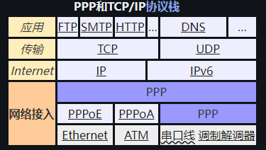
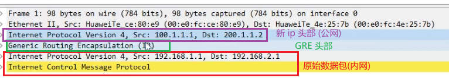
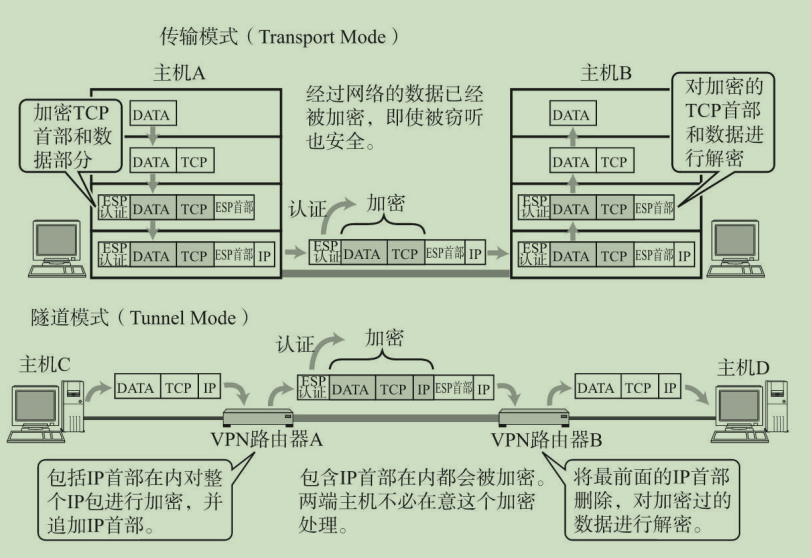
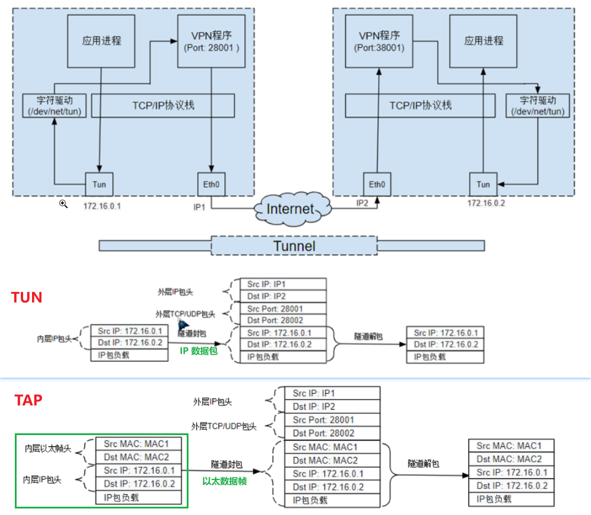

# <font color=#0099ff> **VPN** </font>

> 1. <<图解 TCP/IP>>
> 2. [什么是PPPoE？PPPoE解决了哪些问题？](https://info.support.huawei.com/info-finder/encyclopedia/zh/PPPoE.html)
> 3. [l2tp，pptp，pppoe 的区别](https://pgy.oray.com/news/37617.html)
> 4. [什么是IPsec？](https://info.support.huawei.com/info-finder/encyclopedia/zh/IPsec.html)
> 5. wikipedia :
>    - [防火长城](https://zh.wikipedia.org/wiki/%E9%98%B2%E7%81%AB%E9%95%BF%E5%9F%8E)
>    -

## <font color=#009A000> PPP </font>



PPP (Point to Point Protocol) 点对点协议, L2 层, 是一种点对点协议，通常用于直接连接两台设备，因此不需要 MAC 地址, 设计之初不兼容以太网.

- 在早期的互联网接入中，用户通过调制解调器和电话线连接到互联网服务提供商（ISP）。
- PPP 协议被用于在用户的计算机和ISP的服务器之间建立点对点连接
- 它允许在电话线上安全可靠地传输IP数据包，从而实现互联网访问。

### <font color=#FF4500> PPPoE </font>

PPPoE (PPP over Ethernet) : 以太网上点对点协议, 尽管 PPP 帧和以太网帧不兼容，但 PPPoE 允许在以太网上传输 PPP 帧。PPPoE 将 PPP 帧封装在以太网帧中，从而使 PPP 能够在以太网环境中使用。

- PPPoE 由于集成了 PPP 协议，实现了传统以太网不能提供的身份验证、加密等功能。
- PPPoE 通过唯一的 Session ID 可以很好地保障用户的安全性。
- PPPoE 拨号上网作为一种最常见的方式让终端设备能够连接ISP（Internet Service Provider）从而实现宽带接入。
  - 对于运营商来说，它能够最大限度地利用电信接入网现有的体系结构，利用现有的拨号网络资源，运营和管理的模式也不需要很大的改变；对于用户来说，使用感与原来的拨号上网没有太大区别，较容易接受。

## <font color=#009A000> GRE </font>

GRE (generic routing encapsulation) 通用路由封装 :

<br/> 

1. 在原始数据包的头部添加 GRE 首部 + IP 首部 (L3)
2. GRE本身不提供加密或安全性，而是用来封装数据包，使它们能够通过不同的网络进行传输
3. 异构网络传输 / vpn : 两地的子网架设

## <font color=#009A000> PPTP & L2TP </font>

### <font color=#FF4500> PPTP </font>

```text
+----------------+----------------+-----------------+-----------------+-----------------+
| EthernetHeader | IP Header      | GRE Header      | PPTP Header     | PPP Payload     |
+----------------+----------------+-----------------+-----------------+-----------------+
|  Destination   |   Source       | Version/Type    |  Magic Cookie   |   Payload Data  |
|  MAC Address   |   Address      | Protocol        |  Length         |                 |
|  Source MAC    |   TTL          | Checksum        |  Type           |                 |
|  Address       |   Protocol     | Sequence Number |  Call ID        |                 |
|                |   Checksum     | Length          |  Flags          |                 |
|                |                |                 |  Control Message|                 |
+----------------+----------------+-----------------+-----------------+-----------------+
```

- 即点对点隧道协议（Point-to-Point Tunneling Protocol），是一种用于在IP网络上传输用户数据的协议。
  - `PPP over GRE`
- 由包括微软和 3Com 等公司组成的 PPTP 论坛于 1990 年代联合开发
  - 最早在Windows NT 4.0中被引入, 几乎所有版本的Windows都内置了PPTP客户端和服务器支持
- 工作方式 :
  - PPTP 使用 PPP 协议来进行数据的封装和认证。
  - 数据通过 PPP 协议封装后，再通过 GRE 协议进行隧道封装。
  - PPTP 协议通过 TCP 端口 1723 与 PPTP 服务器进行通信，用于建立和维护隧道。
  - 通过该隧道传输的数据包包括PPP封装的数据，经过 GRE 封装后发送。
- 优缺点 :
  - 配置简单, 兼容性好, 速度较快，延迟较低
  - 安全性较差, 一收中间人攻击(MITM)
  - PPTP 只能在两端点间建⽴单⼀隧道

### <font color=#FF4500> L2TP </font>

```text
+----------------+----------------+-----------------+-----------------+-----------------+
| EthernetHeader | IP Header      | UDP Header      | L2TP Header     | PPP Payload     |
+----------------+----------------+-----------------+-----------------+-----------------+
|  Destination   |   Source       | Source Port     |   Version       |   Protocol      |
|  MAC Address   |   Address      | Destination Port|   Tunnel ID     |   Payload Data  |
|  Source MAC    |   TTL          | Length          |   Session ID    |                 |
|  Address       |   Protocol     | Checksum        |   Length        |                 |
|                |   Checksum     |                 |   Flags         |                 |
|                |                |                 |   Message Type  |                 |
+----------------+----------------+-----------------+-----------------+-----------------+
```

- Layer 2 tunneling protocol, 二层隧道协议
  - 由 Microsoft 和 Cisco 联合开发的，作为 PPTP 的改进版，L2TP 结合了 PPTP 的优势和 L2F（Layer 2 Forwarding）协议的特性
- 工作原理 :
  - 把 PPP（Point - to - Point Protocol）帧封装在 UDP（User Datagram Protocol）数据包中，以此实现数据传输 ，
  - 使用 UDP 端口 1701 进行控制连接
- 常常与 IPsec 协议(传输模式)配合使用，以提供安全性

PPTP vs L2TP :

1. 无论是 GRE 还是 L2TP，它们都使用标准的以太网和 IP 协议头部来进行数据传输
2. 中间 **隧道头部** 不同 :
   1. GRE 头相对较简单，主要用于数据的封装。
   2. L2TP 头则更复杂一些，主要用于VPN（虚拟专用网络）场景, 支持更复杂的隧道管理和加密机制.

## <font color=#009A000> IPsec </font>

<br/> 

上图介绍了 Ipsec 的两种模式 :

- 传输模式 : L2TP（Layer 2 Tunneling Protocol）和 IPSec 结合使用时，IPSec 通常是作为 传输模式（Transport Mode）来保护数据流的, L2TP 用于建立隧道，而 IPSec 则保护隧道中的数据传输
- 隧道模式 :
  - 加密的是 IP 数据包（包括 IP 头和数据部分），而不是物理层的 以太网头。
  - 加密后的数据包会被重新封装在一个新的 IP 数据包中，这个新 IP 数据包会有新的 IP 头（例如 VPN 网关的 IP 地址作为源和目的地）

## <font color=#009A000> OpenVPN </font>

> [TUN与TAP](https://zh.wikipedia.org/wiki/TUN%E4%B8%8ETAP)
> [Linux Tun/Tap 介绍](https://www.cnblogs.com/vmsysjack/p/16212690.html)



OpenVPN 于 2001 年首次发布, 的技术核心是虚拟网卡，其次是 SSL 协议实现。

虚拟网卡在很多的操作系统下都有相应的实现，这也是 OpenVpn 能够跨平台一个很重要的理由。 虚拟网卡是使用网络底层编程技术实现的一个驱动软件，安装后在主机上多出现一个网卡，可以像其它网卡一样进行配置。

- 服务程序可以在应用层打开虚拟网卡，如果应用软件（如 IE）向虚拟网卡发送数据，则服务程序可以读取到该数据
- 如果服务程序写合适的数据到虚拟网卡，应用软件也可以接收得到。

OpenVPN 采用经典的客户端-服务器架构。

- 用户设备上运行 OpenVPN 客户端软件，远程的服务器运行 OpenVPN 服务器软件。
- 客户端连接到服务器，并通过服务器路由网络流量。

在OpenVpn中，如果用户访问一个远程的虚拟地址（属于虚拟网卡配用的地址系列，区别于真实地址），则操作系统会通过路由机制将数据包（TUN模式）或数据帧（TAP模式）发送到虚拟网卡上，服务程序接收该数据并进行相应的处理后，通过 SOCKET 从外网上发送出去，远程服务程序通过 SOCKET 从外网上接收数据，并进行相应的处理后，发送给虚拟网卡，则应用软件可以接收到，完成了一个单向传输的过程，反之亦然。

- TUN 模拟了网络层设备，处理第三层资料包，比如 IP 数据包。 **路由模式**
  - 虚拟网卡仅处理网络层数据包，直接传递 IP 数据包给用户空间程序
  - 客户端和服务器处于不同的 IP 子网，通过 IP 路由进行通信。服务器通常需要配置 NAT (网络地址转换) 来转发客户端的网络流量到互联网。
  - TUN 模式更常用.
- TAP 等同于一个以太网设备，处理第二层资料包如以太网资料帧。 **桥接模式**
  - 虚拟网卡处理完整的以太网帧，包括MAC地址和广播包（如ARP请求）
  - 客户端和服务器处于相同的 IP 子网，通过以太网桥接进行通信。服务器需要配置网络桥接，将 VPN 网络接口桥接到本地网络接口。

路由的选择 :

- 全流量路由（默认常见行为）, : 强制所有网络流量通过 VPN 隧道。
- 分割隧道（Split Tunneling）: 如果配置中明确指定了 route 参数，则只有匹配的目标网络流量会通过 VPN，其他流量仍走本地网络
- 为了确保域名解析也通过 VPN 隧道进行，你可能需要配置 DNS 服务器。

```log
# Linux
ip route show table all
# Windows
route print

# 活动路由:
网络目标        网络掩码              网关            接口   跃点数
# ：这是默认路由（缺省路由），当目标地址不在其他路由规则范围内时，数据包会通过此路由转发。网关地址为 192.168.31.1，表示所有未知目标网络的流量均通过此网关发送
0.0.0.0          0.0.0.0     192.168.31.1    192.168.31.34     25
# 此路由覆盖目标地址为 ​0.0.0.0–127.255.255.255（A类地址）​​ 的流量，优先级高于默认路由（跃点数更低）
0.0.0.0        128.0.0.0       26.26.26.3       26.26.26.1      1
```

## <font color=#009A000> Torjan </font>

Trojan 协议是一种网络代理协议，其设计目标是伪装成普通的 HTTPS 流量，从而绕过网络审查。

## <font color=#009A000> WireGuard </font>

> [WireGuard 教程：WireGuard 的工作原理](https://icloudnative.io/posts/wireguard-docs-theory/)

WireGuard 是一种现代、高效且安全的开源 VPN（虚拟专用网络）协议，设计目标是简化配置流程、提升性能并增强安全性。以下是其核心特点及工作原理的详细介绍：
