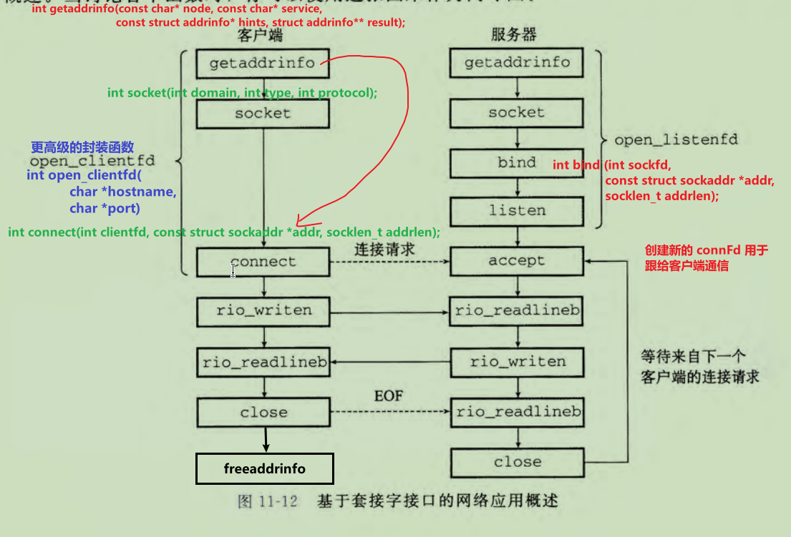

# <font color=#0099ff> **socket 编程** </font>

> `@think3r` 2024-09-18 21:49:18 <br/>
>
> 1. <<深入理解计算机系统>>
> 2. [Socket编程入门 - Socket通信技术简明教程](https://www.dotcpp.com/course/socket/)
> 3. [集线器、网桥、交换机、路由器](https://zhuanlan.zhihu.com/p/649762444)
> 4. [硬核图解！30张图带你搞懂！路由器，集线器，交换机，网桥，光猫有啥区别？](https://golangguide.top/%E8%AE%A1%E7%AE%97%E6%9C%BA%E5%9F%BA%E7%A1%80/%E7%BD%91%E7%BB%9C%E5%9F%BA%E7%A1%80/%E6%A0%B8%E5%BF%83%E7%9F%A5%E8%AF%86%E7%82%B9/%E7%A1%AC%E6%A0%B8%E5%9B%BE%E8%A7%A3%EF%BC%8130%E5%BC%A0%E5%9B%BE%E5%B8%A6%E4%BD%A0%E6%90%9E%E6%87%82%EF%BC%81%E8%B7%AF%E7%94%B1%E5%99%A8%EF%BC%8C%E9%9B%86%E7%BA%BF%E5%99%A8%EF%BC%8C%E4%BA%A4%E6%8D%A2%E6%9C%BA%EF%BC%8C%E7%BD%91%E6%A1%A5%EF%BC%8C%E5%85%89%E7%8C%AB%E6%9C%89%E5%95%A5%E5%8C%BA%E5%88%AB%EF%BC%9F.html)
>    - <https://github.com/xiaobaiTech/golangFamily>

## <font color=#009A000> 0x00 base </font>

- 两台电脑可以通过一根网线直接连接，进行通信。
- 机器一多，可以把网线都接到 ~~**集线器**~~（物理层）上，但是集线器会不管三七二十一进行广播。
  - 一个电脑只有一个网口
- 不想广播，可以用（二层）交换机（数据链路层），又叫 ~~**多端口网桥**~~，它比较聪明，会自我学习生产 MAC 地址表，知道消息发到哪，那就不需要广播啦
  - 交换机，是不具备 MAC 地址的，而 MAC 报头是需要填上目的 MAC 地址的。因此交换机从来都不是数据的目的地，它只简单转发数据帧到目的地。
- 互联网电脑这么多，交换机 MAC 地址表总不能全放下吧。改用路由器（网络层），也叫三层交换机，
  - 通过网段的方式定位要把消息转发到哪，就不需要像交换机那样苦哈哈一条条记录 MAC 地址啦。
  - 路由器可以适配不同速度的网络
  - 路由器，是有 MAC 地址的，因此 MAC 报头就可以写上，下一站目的地就是 xx 路由. 到了路由器后，路由器可以再次组装下一站的目的 MAC 地址是再下一个路由，通过这一点，让数据在路由和路由之间传输。
  - 找不到转发目的地时的处理方式有区别
    - 如果在路由表中无法找到匹配的记录，路由器会丢弃这个包，并通过 `ICMP` 消息告知发送方。
    - 而交换机在 MAC 地址表里找不到转发端口时会选择广播。
    - 这里的处理方式两者是不同的，原因在于网络规模的大小。
- 路由器和光猫之间是好搭档，光猫负责把光纤里的光信号转换成电信号给路由器。
- 现在一般情况下，**家里已经不用集线器和交换机了**，大部分路由器也支持交换机的功能。所以可以看到，家里的台式机电脑一般就连到一个路由器，再连个光猫就够能快乐上网了。

## <font color=#009A000> 0x01 socket 编程 </font>

- 同步，就是在发出一个功能调用时，在没有得到结果之前，该调用就不返回，同时其它线程也不能调用这个方法。
- 异步，就是发出一个功能调用后，不管没有结果的返回，都不影响当前任务的继续执行。即两个生产线相互独立。
- 网络字节顺序(network byte order) : 大端字节顺序
- 域名 (domain name)
  - 因特网定义了域名集合和 IP 地址集合之间的映射。直到 1988 年，这个映射都是通过一个叫做 `H0STS.TXT` 的文本文件来手工维护的。从那以后，这个映射是通过分布世界范围内的数据库（称为 DNSCDomainNameSystem, 域名系统））来维护的。
  - 查看制定 DNS 返回的域名解析 : `nslookup IP DNS`
  - 在某些情况下，多个域名可以映射为同一个 IP 地址
  - 多个域名可以映射到同一组的多个 IP 地址
- 毎个套接字都有相应的套接字地址 : 由一个因特网地址和一个 16 位的整数端口组成, 即 `地址：端口`
  - 当客户端发起一个连接请求时，客户端套接字地址中的端口是由内核自动分配的，称为临时端口 (ephemeral port)
  - 然而，服务器套接字地址中的端口通常是某个知名端口，是和这个服务相对应的
    - Web 服务器通常使用端口 `80`
    - 而电子邮件服务器使用端口 `25`
    - ssh 服务器使用端口 `22`
    - `/etc/services` 包含一张这台机器提供的知名名字和知名端口之间的映射
  - —个连接是由它两端的套接字地址唯一确定的。这对套接字地址叫做套接字对(socket pair) : `(cliaddr: cliport , servaddr :servport)`

```c
/* IP address structure */
struct in_addr {
    uint32_t s_addr; /* Address in network byte order (big-endian) */
}

// 'n' 代表网络， 'p' 代表表示。
#include <arpa/inet.h>
int inet_pton(AF_INET, const chax *src, void *dst); // 返回：若成功则为 1，若 src 为非法点分十进制地址则为 0, 若出错则为一1。
const char *inet_ntop(AF_INET, const void *src, char *dst, socklen_t size); // 返回：若成功则指向点分十进制字符串的指针，若出错则为 NULL

// _in 为 internet 的缩写
/* IP socket address structure */
struct sockaddr_in {
    uintl6_t sin_family;        /* Protocol family (always AF_INET) */
    uintl6_t sin_port;          /* Port number in network byte order */   // 16bit 端口号
    struct in_addr sin_addr;    /* IP address in network byte order */    // IP　地址
    unsigned char sin_zero[8];  /* Pad to sizeof(struct sockaddr) */
};
/* Generic socket address structure (for connect, bind, and accept) */
struct sockaddr {
  uintl6_t sa_family;           /* Protocol family */
  char sa_data[14];             /* Address data */    // 填充字节 : 2 + 4 + 8 = 14 ; sizeof(sockaddr) = sizeof(sockaddr_in)
}

// NOTE: sockaddr 和 sockaddr_in 两个结构体之间可强制转换, 以解决当时没有 `void*` 的问题


// getaddrinfo() 函数
struct addrinfo {
    int ai_flags;                 /* AI_PASSIVE, AI_CANONNAME, AI_NUMERICHOST */
    int ai_family;                /* PF_xxx */                                // IPV*/IPV4/IPV6
    int ai_socktype;              /* SOCK_xxx */                              // TCP/UDP
    int ai_protocol;              /* 0 or IPPROTO_xxx for IPv4 and IPv6 */
    socklen_t ai_addrlen;         /* length of ai_addr */
    char  * ai_canonname;         /* canonical name for hostname */
    struct  sockaddr *ai_addr;    /* binary address */
    struct  addrinfo *ai_next;    /* next structure in linked list */         // 链表...
}
```



## <font color=#009A000> Web </font>

对于 Web 客户端和服务器而言，内容是与一个 `MIME` (Multipurpose Internet MailExtensions 多用途的网际邮件扩充协议)类型相关的字节序列.

Web 服务器以两种不同的方式向客户端提供内容：

- 取一个磁盘文件，并将它的内容返回给客户端。磁盘文件称为静态内容(static content), 而返回文件给客户端的过程称为服务静态内容(serving static content)
- 运行一个可执行文件，并将它的输出返回给客户端。运行时可执行文件产生的输出称为动态内容 (dynamic content), 而运行程序并返回它的输出到客户端的过程称为服务动 态内容 (serving dynamic content)。
  - 确定一个 URL 指向的是静态内容还是动态内容没有标准的规则。
- URL(Universal Resource Locator, 通用资源定位符) : `http://ww.google.com:80/index.html`
  - 端口号是可选的，默认为知名的 HTTP 端口 80
  - 可执行文件的 URL 可以在文件名后包括程序参数。`？` 字符分隔文件名和参数，而且每个参数都用 `&` 字符分隔开 : `http://bluefish.ics.cs.emu.edu:8000/cgi-bin/adder?15000&213`
  - 后缀中的最开始的那个 `/` 不表示 Linux 的根目录。相反，它表示的是被请求内容类型的主目录
  - 最小的 URL 后缀是 `/` 字符，所有服务器将其扩展为某个默认的主页，例如 `/index.html` 这解释了为什么简单地在浏览器中键人一个域名就可以取出一个网站的主页
    - `baidu.com` = `baidu.com/index.html`
- ~~因为 HTTP 是基于在因特网连接上传送的文本行的，我们可以使用 Linux 的 `TELNET` 程序来和因特网上的任何 Web 服务器执行事务。~~
