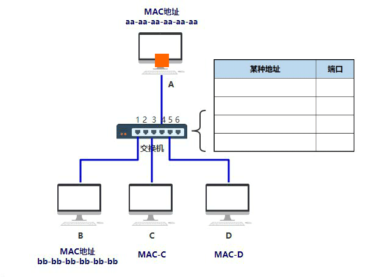
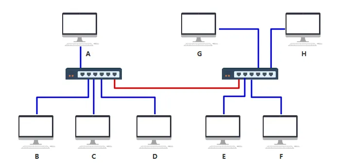
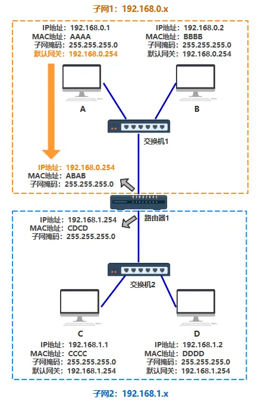
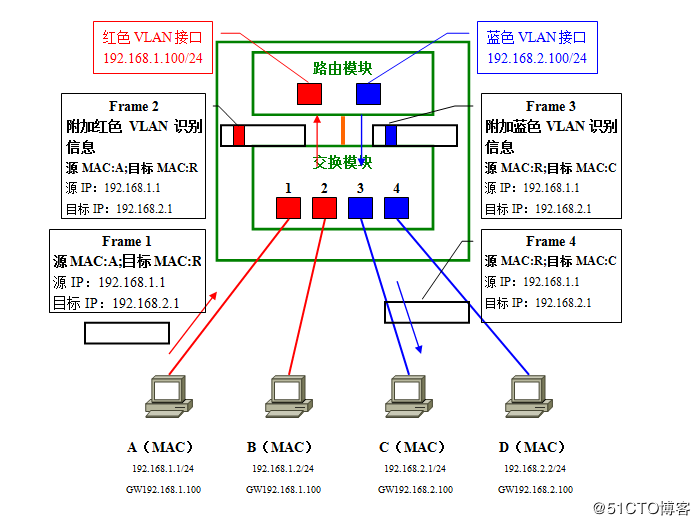
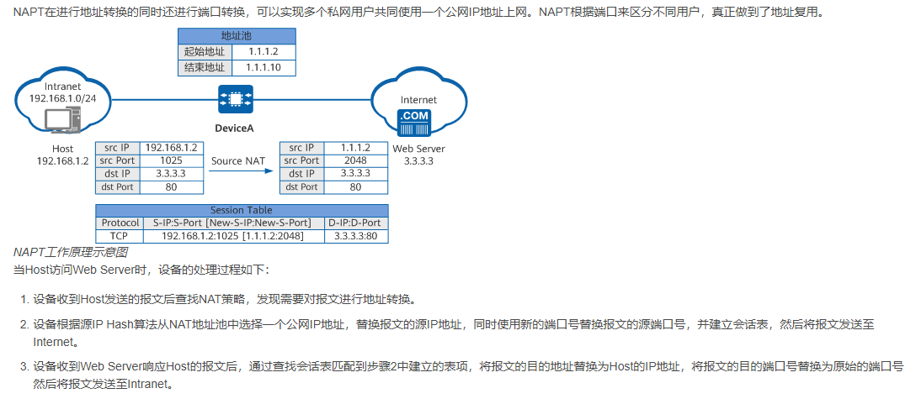

#  **网络基础知识 base** 

> `@think3r` 2025-02-21 23:34:50
>
> 1. 书籍 :
>    - <<图解网络硬件>>
>    - <<计算机网络 -- 自顶向下方法>>
>    - <<图解 TPC/IP>>
> 2. [如果让你来设计网络](https://mp.weixin.qq.com/s?__biz=MzkxMDc1MDg1Nw==&mid=2247508504&idx=1&sn=b21196cfd1c3cbde80119240c9d2cd81&source=41#wechat_redirect)
>    - [网络发展史 -- 知乎](https://www.zhihu.com/question/21546408/answer/2120115071)
>    - [集线器、网桥、交换机、路由器](https://zhuanlan.zhihu.com/p/649762444)
>    - [硬核图解！30张图带你搞懂！路由器，集线器，交换机，网桥，光猫有啥区别？](https://golangguide.top/%E8%AE%A1%E7%AE%97%E6%9C%BA%E5%9F%BA%E7%A1%80/%E7%BD%91%E7%BB%9C%E5%9F%BA%E7%A1%80/%E6%A0%B8%E5%BF%83%E7%9F%A5%E8%AF%86%E7%82%B9/%E7%A1%AC%E6%A0%B8%E5%9B%BE%E8%A7%A3%EF%BC%8130%E5%BC%A0%E5%9B%BE%E5%B8%A6%E4%BD%A0%E6%90%9E%E6%87%82%EF%BC%81%E8%B7%AF%E7%94%B1%E5%99%A8%EF%BC%8C%E9%9B%86%E7%BA%BF%E5%99%A8%EF%BC%8C%E4%BA%A4%E6%8D%A2%E6%9C%BA%EF%BC%8C%E7%BD%91%E6%A1%A5%EF%BC%8C%E5%85%89%E7%8C%AB%E6%9C%89%E5%95%A5%E5%8C%BA%E5%88%AB%EF%BC%9F.html)
>    - <https://github.com/xiaobaiTech/golangFamily> TODO:
> 3. NAT :
>     - [家庭网络优化指南：提升NAT类型，降低游戏延迟、提高下载速度](https://mao.fan/article/90)
>     - [什么是 NAT？ -->  华为百科](https://info.support.huawei.com/info-finder/encyclopedia/zh/NAT.html)
> 4. [FPGA 是网络交换领域的不二选择](https://zhuanlan.zhihu.com/p/112055720)
> 5. VLAN
>    - [什么是 VLAN - 华为百科](https://info.support.huawei.com/info-finder/encyclopedia/zh/VLAN.html)

##  0x00 网络硬件 

###  ~~0.~~ 

1. 中继器 : 放大信号, L1
2. ~~网桥~~

###  1. 集线器 

- 两台电脑可以通过一根网线直接连接，进行通信。
- 机器一多，可以把网线都接到 ~~**集线器 (HUB)**~~（物理层）上，但是集线器会不管三七二十一进行广播。
  - **一个电脑一般只有一个网口 + 布线的复杂性**
  - 内部电路线缆的直接物理连接
- 数学表示 :
  - 矩阵 𝐻 的每一行代表一个端口的输出情况，值为1表示该端口的数据会被广播到其他端口，值为 0 表示该端口的数据不会传输到自己。
  - 如果我们表示集线器中第 $i$ 个端口接收到的数据为 $x_i$，那么集线器广播后的输出数据 $y_i$ 可以表示为：  
    $$
    \\
    H =
    \begin{bmatrix}
    0 & 1 & 1 & \dots & 1 \\
    1 & 0 & 1 & \dots & 1 \\
    1 & 1 & 0 & \dots & 1 \\
    \vdots & \vdots & \vdots & \ddots & \vdots \\
    1 & 1 & 1 & \dots & 0
    \end{bmatrix}
    \\[5px]
    y_i = \sum_{j=1, j \neq i}^{n} x_j \\
    $$
    

###  2. 交换机 

- 不想广播，可以用（**二层**）交换机（SWITCH, 数据链路层），又叫 **交换式集线器**，它比较聪明，会自我学习生产 MAC 地址表，知道消息发到哪，那就不需要广播啦
  - 将连接着两台通信终端的两个端口在装置内部绑定, 使其它端口的信号无法介入, 从而防止发生冲突.
  - 交换机，是不具备 MAC 地址的，而数据包的 MAC 报头是需要填上目的 MAC 地址的。因此交换机从来都不是数据的目的地，它只简单转发数据帧到目的地
    - MAC 地址数 : 1 台交换机能够学习到的 mac 地址表的最大数量. 小型交换机的典型值为 1000~10000.
  - 交换机的处理能力 :
    - 背板容量(backplane) / 交换机容量 : $端口数量 * 2 * 单口速速$
    - 非阻塞式(non-blocking)
    - 交换结构过载(over-subscription)
  - ~~不具备 mac 地址, 则证明其不属于联网电脑的对等层次.~~

    

    

###  3. 路由器 

- 随着网络规模的扩大，交换机开始力不从心了 :
  - 问题的根本在于，上图中连出去的那根红色的网线，后面不知道有多少个设备不断地连接进来，**从而使得 MAC 地址表越来越大**。
  - 那我可不可以让那根红色的网线，接入一个新的设备，这个设备就跟电脑一样有自己独立的 MAC 地址，而且同时还能帮我把数据包做一次转发呢？ 改用路由器（网络层），也叫 **三层** 交换机  
    - 不需要保存网络中的所有 MAC 地址，只要保存网络前缀(子网段)就能进行转发
    - 但子网内的传输还是要依赖 mac 地址的, 因此哪怕是引入了 IP 层，实际通信还是依赖 MAC 地址
      
- Q&A :
  1. 两个设备之间通信, 怎样知道是否要通过路由器转发呢?
     - 通过引入新的字段 `ip + mask`, 来标明子网
     - 不同子网范围内的设备才需要经过路由器
  2. A 如何知道，哪个设备是路由器？
     - 其实说发给路由器不准确，应该说 A 会把包发给 **默认网关** (dst-mac)
     - 对 A 来说，A 只能直接把包发给同处于一个子网下的某个 IP 上，所以发给路由器还是发给某个电脑，对 A 来说也不关心，只要这个设备有个 IP 地址就行。
     - 所以默认网关，就是 A 在自己电脑里配置的一个 IP 地址，以便在发给不同子网的机器时，发给这个 IP 地址。
  3. 路由器如何知道 C 在哪里？
     - 通过路由表, 让自己知道收到的这个数据包，该从自己的哪个端口出去
       - 路由表中记录的是 子网+其对应的端口号
     - 路由表由路由算法得出
  4. 刚才说的都是 IP 层，但发送数据包的数据链路层需要知道 MAC 地址，可是我只知道 IP 地址该怎么办呢？
     - 假如你（A）此时不知道你同伴 B 的 MAC 地址（现实中就是不知道的，刚刚我们只是假设已知），你只知道它的 IP 地址，你该怎么把数据包准确传给 B 呢？ 通过 ARP 协议.
     - 答案很简单，在网络层，我需要把 IP 地址对应的 MAC 地址找到，也就是通过某种方式，找到 `192.168.0.2` 对应的 MAC 地址 BBBB。这种方式就是 `arp` 协议，同时电脑 A 和 B 里面也会有一张 `arp` 缓存表，表中记录着 IP 与 MAC 地址的对应关系。
- 角色视角 :
  1. 电脑视角：
     - 首先我要知道我的 IP 以及对方的 IP (都知道了才能通信)
     - 通过子网掩码判断我们是否在同一个子网
     - 在同一个子网就通过 arp 获取对方 mac 地址直接扔出去
     - 不在同一个子网就通过 arp 获取默认网关的 mac 地址直接扔出去
  2. L2 交换机视角：
     - 我收到的数据包必须有目标 MAC 地址
     - 通过 MAC 地址表查映射关系
     - 查到了就按照映射关系从我的指定端口发出去
     - 查不到就所有端口都发出去
  3. 路由器视角：
     - 我收到的数据包必须有目标 IP 地址
     - 通过路由表查映射关系
     - 查到了就按照映射关系从我的指定端口发出去（不在任何一个子网范围，走其路由器的默认网关也是查到了）
     - 查不到则返回一个路由不可达的数据包
  4. 三张表 :
     1. 交换机中有 MAC 地址表用于映射 MAC 地址和它的端口(物理端口号, 区别于 `ip:port`)
        - MAC 地址表是通过以太网内各节点之间不断通过交换机通信，不断完善起来的。
     2. 路由器中有路由表用于映射 IP 地址(段)和它的端口
        - 路由表是各种路由算法 + 人工配置逐步完善起来的
        - 路由器 1 连接了路由器 2，所以其路由表有了下一条地址(下一跳)这一个概念
     3. 电脑和路由器中都有 arp 缓存表用于缓存 IP 和 MAC 地址的映射关系
        - arp 缓存表是不断通过 arp 协议的请求逐步完善起来的。
  5. NOTE: <u>**网络层（IP协议）本身没有传输包的功能，包的实际传输是委托给数据链路层（以太网中的交换机）来实现的。**</u>
- 路由表的构成 :
  - dst ip + mask : 构成 dst 子网
  - gateway(网关)/next hop(下一条) : 分组下一步需要转发到的 ip 地址.
  - 网络接口
  - 度量值: 有多少条路径可达相同的目的地址, 越小优先级越高
- 路由器总结 :
  - 通过网段的方式定位要把消息转发到哪，就不需要像交换机那样苦哈哈一条条记录 MAC 地址啦。
  - 路由器可以适配不同速度的网络
  - 一台路由器对它的每个接口都有一个 IP 地址
    - 主要用于连接不同的子网络并通讯的, 因此在不同的网段中都必须要存在(拥有 mac + ip)
    - 家用路由器是特例
  - 路由器自己是有 MAC 地址的，因此 MAC 报头就可以写上，下一站目的地就是 xx 路由. 到了路由器后，路由器可以再次组装下一站的目的 MAC 地址是再下一个路由，通过这一点，让数据在路由和路由之间传输。
  - 找不到转发目的地时的处理方式有区别
    - 如果在路由表中无法找到匹配的记录，路由器会丢弃这个包，并通过 `ICMP` 消息告知发送方。
    - 而交换机在 MAC 地址表里找不到转发端口时会选择广播。
    - 这里的处理方式两者是不同的，原因在于网络规模的大小。
- 路由器和光猫之间是好搭档，光猫负责把光纤里的光信号转换成电信号给路由器。
- 现在一般情况下，**家里已经不用集线器和交换机了**，大部分路由器也支持交换机的功能。所以可以看到，家里的台式机电脑一般就连到一个路由器，再连个光猫就够能快乐上网了。
  - 集线器和交换机用于构建网络
  - 路由器用于连接网络
- 至此，经过物理层、数据链路层、网络层这前三层的协议，以及根据这些协议设计的各种网络设备（网线、集线器、交换机、路由器），**理论上只要拥有对方的 IP 地址**，就已经将地球上任意位置的两个节点连通了。
  - 如果 A 给 F 发送一个数据包，能不能通呢？如果通的话整个过程是怎样的呢？  
     

###  ip/port 

- mac :
  - 用于网络物理层的传输, 局域网内使用
- ip : 用于标识电脑/设备, 通信必须要知道 src 和 dst 的 ip
  - ip 地址可变, mac 地址一般是不变的;
  - ip 用于定位 locate Device(定位最终的网络), mac 用于标识 identify Device(局域网内的哪个设备)
- mask : 子网掩码一定是以连续的 1 开始, 以连续的 0 结束, 因此可以只使用 $/x\;bit$ 来表示.
- port : 端口用于标识 ip 设备中的一个服务/应用
  - `0~1023`  : 常用于服务器监听, 公认端口(Well-Known Port)
  - `1024~49151` : 注册端口 (Registered Port), 可供机构申请
  - `49151~65535` : 动态/私有端口, 用于临时连接

###  IANA 

[IANA](https://en.wikipedia.org/wiki/Internet_Assigned_Numbers_Authority) （Internet Assigned Numbers Authority，互联网号码分配机构） :

1. 定义/分配常用端口, 见上方的常用端口号
2. Domain Names 域名管理
3. protocol 协议管理(诸如各类 `RFC`)
4. IP address : 定义了私有网络, 私有网络地址一般在局域网内使用, 无法在 internet 公网使用 (私有网络地址不唯一!)

| 地址范围 | 前缀 | 地址数 | 用途 |
|---|---|---|---|
| 10.0.0.0 - 10.255.255.255 | /8 | 16,777,216 | 用于大型私有网络 |
| 172.16.0.0 - 172.31.255.255 | /12 | 1,048,576 | 用于中型私有网络 |
| 192.168.0.0 - 192.168.255.255 | /16 | 65,536 | 用于小型私有网络 |

###  ARP 协议 

- ARP 是在局域网(LAN)中通过 IPV4 地址获取其对应 mac 地址的网络协议
- ARP 请求包：
  - E.g. : 谁有 192.168.1.10 这个 IP 地址？请发送你的 MAC 地址给我
  - 包内容 :
    - 发送者的硬件地址（MAC 地址）+ 发送者的协议地址（IP 地址）
    - 目标的硬件地址（MAC 地址，初始化为全 `F`）+ 目标的协议地址（IP 地址）, ARP 报文的实际信息段填充的是全 0
  - > [mac地址全0代表什么？全为1是代表广播地址吗？](https://www.zhihu.com/question/22845688/answer/22831067)
    - 广播：通过将目标 MAC 地址设置为 FF:FF:FF:FF:FF:FF，ARP 请求会被广播(flooding)到网络中的所有设备，所有设备都可以看到这个请求并决定是否需要响应
- ARP 响应包：
  - 发送者的硬件地址（MAC 地址）+ 发送者的协议地址（IP 地址）
  - 目标的硬件地址（MAC 地址） + 目标的协议地址（IP 地址）
- ARP 表的记录会有超时值(mac 地址的老化时间 `aging time`), 以此来避免设备物理结构的变化和 mac 表对应失败
  - win cmd : `arp -a`
  - linux cmd : `arp -n` / `ip -s neighbor`
- RARP(reverse ARP) : 通过 mac 地址反向获取 Ip
  - 常用于 打印机等小型嵌入式设备
  - 需要管理员在 RARP 服务器上预先静态配置 MAC 地址与 IP 地址的映射表，无法动态分配地址

###  IP VS MAC 

- IEEE & IETF 两拨人对互联网的设计 :
  - IEEE 以太网设计了 MAC 地址
  - IETF 设计了网络/IP 层, 给每台网络设备设计一个逻辑地址 : IP 地址, 32bit
    - 甚至都没考虑 mac 是 48bit 的....
    - 引入 IP 层也是为了解决单纯 mac 层的问题(广播风暴), 同时考虑到了配置变化(IP 变化)
      - IP 报文中的 ttl 也是一种解决网络风暴的设计
- ~~能不能最终去掉MAC地址，而只保留 IP 地址呢？~~
  - > <https://www.zhihu.com/question/21546408/answer/2120115071>
  - 理论上是可行的。交换机既然可以学习 MAC 地址，那就一定可以学习 IP 地址。这样，每个网口所连电脑的 IP 映射关系也就知道了。电脑 A 如果想给 C 发数据，可以不查 C 的 MAC 地址，而是直接给交换机发一个 IP 报文（注意，这次没有 MAC 帧）。交换机收到后直接转发给电脑 C。整个过程就仿佛回到了最开始的点对点链接路
  - 现在没有去掉 MAC 地址，可能是因为以太网设备已经遍布全球，也足够便宜，已经没有必要再优化了。但从原理上看，MAC 地址确实可以去掉。
  - 省流助手：先出的 MAC 后出的 IP，没废是为了向下兼容。（不过IPv6协议里MAC已经相当于废了）

###  单播/广播/多播/任播 

| 类型 (Type)   | 描述 (Description)       | 目标设备数量 (Target Devices) | 工作原理 (Working Principle)     | 常见应用场景 (Common Use Cases)                  |
|---------------|---------------------------------------------------------------|-----------------------------|-------------------------------------------------------------------------------------------------|-----------------------------------------------------------------------------------------------------------|
| 单播 (Unicast)   | 单播是指从一个源设备发送数据到一个特定目标设备。                   | 1 个设备 (One Device)       | 数据包由源设备发送到目标设备的唯一地址，每个通信对独立进行。     | 一台计算机向另一台计算机发送数据，浏览器访问特定网站时的 HTTP 请求/响应、电话通话等|
| 广播 (Broadcast)   | 广播是指从一个源设备发送数据到同一网络中所有设备。| 所有设备 (All Devices)      | 数据包通过网络广播发送，所有处于同一网络中的设备都会接收并处理。         | 局域网（LAN）中的 ARP 请求，网络发现协议（如 NetBIOS）、路由器的 OSPF 协议中的广播数据包    |
| 多播 (Multicast)   | 多播是指从一个源设备发送数据到特定的一组设备。  | 一组设备 (A Group of Devices) | 数据包发送到一个多播组地址，只有加入该组的设备接收数据。| 视频会议、直播流媒体、IPTV、在线游戏中的玩家间数据同步等   |
| 任播 (Anycast)   | 任播是指从一个源设备发送数据到离源设备最近的一个设备（通常为多个目的设备中的一个）。 | 1 个设备（最接近）(One Device - Nearest) | 数据包发送到多个设备中的一个，通常是距离源设备最近或最优的设备。设备通过路由协议决定最优路径。  | 内容分发网络（CDN）、负载均衡系统、DNS 服务器中的请求路由等             |

##  0x01 VLAN & 三层交换机 

> 1. [图文并茂VLAN详解，让你看一遍就理解VLAN](https://zhuanlan.zhihu.com/p/385949949)
> 2. [路由器和三层交换机之间到底有什么区别？](https://zhuanlan.zhihu.com/p/104093580)

| 特性         | `LAN`  (Local Area Network, 局域网)          | `WAN` (Wide Area Network ,广域网)                                 |
|--------------|--------------------------------------------|---------------------------------------------|
| 定义         | 局部范围内的网络，通常覆盖较小地理区域。        | 覆盖广泛地理区域的网络，通常跨越城市、国家或全球。   |
| 范围         | 一般局限于一个建筑物、校园或办公区。          | 可以跨越多个城市、国家，甚至是国际范围。            |
| 速度         | 通常速度较快，几十 Mbps 到几 Gbps 不等。       | 速度较慢，通常受限于不同地区的基础设施。            |
| 连接方式     | 常用以太网、Wi-Fi 等技术连接。                | 通过公共或私人电信线路、卫星或光纤连接。             |
| 成本         | 较低，通常只涉及购买设备和安装。               | 较高，涉及长期运营费用和维护成本。                   |
| 管理         | 由单一组织或公司管理。                        | 由多个组织或服务商管理，可能涉及多个运营商。         |
| 数据传输量   | 相对较高，适合大规模的数据传输。               | 传输量较低，可能会有延迟和带宽限制。                 |
| 安全性       | 安全性较高，易于控制。                        | 安全性相对较低，容易受到攻击或干扰。                 |

###  VLAN 

VLAN (Virtual LAN, 虚拟局域网), 分割 LAN 广播域的虚拟网络.

- 需求的诞生 :
  - 性能 : 随着本地网络规模的扩充, 广播帧会非常频繁地出现, 消耗了网络整体的带宽, 同时消耗整个网络中的计算资源.
    - 如下为常见的广播通信 : ARP, RIP, DHCP, NetBEUI(Windows下双击打开“网络计算机”时发出点广播/多播信息), IPX ....
    - NOTE: 在没有 VLAN 的情况下，所有连接到同一个交换机的设备都会在同一个 IP 子网中，这些设备会共享同一个广播域.
  - 安全性 : 某个子网络内部的故障(E.g. : 广播风暴)不会扩散
  - 方便/灵活管理 : 物理接口/设备不变, 所属 (V)LAN 要变化 <---- 人员流动.
- 为何不用路由器 :
  - 通常情况下路由器上不会有太多的网络接口，其数目多在 1～4 个左右, 所能分割的个数完全取决于路由器的网络接口个数, 无法灵活满足需求
    - 家用路由器上面虽然带着多个（一般为 4 个左右）连接 LAN 一侧的网络接口，但那实际上是路由器内置的交换机，并不能分割广播域
  - 二层交换机一般带有多个网络接口。因此如果能使用它分割广播域，那么无疑运用上的灵活性会大大提高。
- VLAN 实现 :
  - 二层交换机的 VLAN : 将端口和 VLAN-id 绑定, 同组 vlan 之间转发, 即可.
    - 在交换机上设置 VLAN 后，如果未做其他处理，VLAN 间是无法通信的 --> 通过上一级路由器转发 ---> **单臂路由**
    - 收发信双方同属一个 VLAN 之内的通信，一切处理均在交换机内完成
    - VLAN 之间通信 : `发送方—>交换机——>路由器——>交换机——>接收方`
  - 三层交换机 : 见下方
- VLAN 和 子网的关系 :
  - **一般来说单个 VLAN 内的 IP 地址都属于同一个子网**
    - 从技术角度来看，它们并不是完全等价的概念。VLAN 是二层网络的划分，子网是三层网络的划分。
  - 可能会出现多个 VLAN 共享同一个子网
  - 或者一个 VLAN 内的设备跨越多个子网（不过这种设计不常见，且通常涉及复杂的路由配置
- VLAN 类型 :
  - 基于端口的 VLAN.
  - 跨越多台交换机的 VLAN --> 汇聚链路

###  三层交换机 

  

- 三层交换机处理 数据帧时的流程 :
  - 二层交换：三层交换机像普通的二层交换机一样，通过 MAC 地址 来转发数据帧。
  - 三层路由：三层交换机能够根据 IP 地址 来转发数据包，具备路由器的部分功能。 **见上图**
- 出现原因 :
  - 解决同一个交换机不同 VLAN 之间通信要过一个单独路由器的问题
  - 优化各个子网络性能
- 交换机 vs 路由器 @ 性能:
  - 交换机主要功能是交换数据，其内部是硬件直接处理数据包的，也就是硬件转发(电路直接连通), 可以轻轻送送跑到满线速(而且几十个口一起跑到线速)
    - 速度对比
      - 现在几乎随便找个 5 口千兆交换机人家都能跑到 1.48Mpps（千兆满血）还是每个口同时
      - 而一般来说几百 kpps 的 DOS 攻击都足以让不设防的电脑，服务器以及一部分防火墙跪下唱征服
    - 加速原因 : 硬件化了路由模块, 局域网内的简单化组网(相较于 LAN)使得硬件化成为可能.
  - 路由器是做什么的呢？确实可以跨网段转发数据，**但路由器真正的用途是计算路由**
    - 更注重广域网 WAN 连接, 同事具备更多功能 : 防火墙、NAT（网络地址转换）、VPN 等
    - **复杂的路由决策** : *图论 + 路由协议*
      - 计算路由这个问题 **太复杂** 了，无法像交换机那样简单粗暴的用硬件解决。所以只能用常规的通用计算机的方案，**也就是用高性能的 CPU 来算**
- 路由表计算的复杂性:
  - 早期互联网并没打算接入那么多设备，网段划的简单粗暴，地址分个ABC类就完事了。后来设备和网络越来越多，大家就只好把大的网络切成小网段用，比如一个/16的网段切成四个/18的网段，一个/24的网段切成16个/20的网段，etc...
  - 切来切去网段（节点）越来越多，到这些网段（节点）的全部路由信息称之为 **全路由** （Full route），全路由在2020年初这个时间点上大概有70万条，一般的路由器要计算大概 3 到 20 分钟吧
  - [Cloudflare radar 路由](https://radar.cloudflare.com/zh-cn/routing)
  - 关键词 : <u>**全球路由表**</u> NOTE:
    - 只有直接参与BGP路由信息交换（例如互联网骨干路由器或运营商边界路由器）的设备才会维护完整的 BGP 全路由表
    - 对于很多边缘网络或小型ISP来说，通常只配置默认路由或汇总路由，根本不需要存储全路由表，从而大大减少了资源消耗
      - 默认路由，也称为“网关 of last resort”，是一个特殊的路由条目，其网络前缀为“0.0.0.0/0”。
      - 这条路由的含义是匹配所有IPv4地址，因为“0.0.0.0”代表所有比特均为0，而“/0”则表示没有固定的网络部分，所以整个IPv4地址空间都包含在内。
      - 当路由器在查找数据包的目的地址时，会根据最长前缀匹配原则在路由表中寻找最具体的匹配项。如果没有找到任何比默认路由更具体的匹配，则数据包会被转发到默认路由指定的下一跳。这就是为什么默认路由被称为“最后手段的网关”（gateway of last resort）。
  - 路由器的路由表存储需求因其在网络中的位置和功能而异，具体可分为以下几类：
    - 边缘路由器（如家用/企业级路由器）​: 这类路由器通常仅需存储默认路由（0.0.0.0/0）​，指向其上游运营商的路由器即可满足需求
    - 运营商骨干路由器 : 这类路由器需要维护完整的或接近完整的公网路由表

###  DHCP 

TODO:

###  ICMP 

TODO:

###  家用路由器 TODO: 

> [小米AX3000T解锁SSH 安装shellclash小猫咪＆固化SSH+开启外网访问web页面](https://mao.fan/article/102)

- 家用路由器硬件
- 路由器当交换机用 ?
- 家用网络设计

###  IPTV TODO: 

[为什么中国移动的 IPTV 只能直连光猫，不能接路由器？]([https://](https://www.zhihu.com/question/643378577))

###  other 

没有 IP 路由功能仅处理数据链路层的交换机称为 L2 交换机. 带有 Ip 路由功能的交换机称为 L3 交换机(~~路由器~~).

- 尽管 L3 交换机具备某些路由功能，但由于它的核心功能仍然是交换（尤其是在局域网内），它通常不被称为 路由器。路由器通常有更多复杂的功能和更强的适应性来应对大规模的、跨区域的网络连接。L3 交换机可以看作是一种 具有路由功能的交换机，而不是一个全面的 路由器。

| 特性            | L2 交换机          | L3 交换机            | 路由器                |
|-----------------|---------------------------------------|-----------------------------------------|-------------------------------------------|
| **工作层次**        | 数据链路层（第2层）                   | 网络层（第3层）     | 网络层（第3层）       |
| **主要功能**        | 根据 MAC 地址转发数据帧               | 根据 IP 地址进行路由和转发              | 根据 IP 地址进行路由和转发，连接不同网络  |
| **适用范围**        | 局域网内部设备连接| 大型网络、多个子网或 VLAN 之间的路由    | 跨不同网络的连接，广域网（WAN）中的路由   |
| **支持路由**        | 不支持            | 支持，具备路由功能  | 支持，具备动态路由协议（如 RIP、OSPF、BGP） |
| **扩展性**          | 只能处理同一广播域内的通信            | 支持跨子网通信，适用于大规模网络       | 支持跨广域网通信，连接不同的网络或子网    |
| **配置复杂度**      | 配置简单          | 配置较复杂，需要路由协议支持           | 配置较复杂，支持多种路由协议和安全功能    |
| **硬件设计**        | 基于交换硬件（ASIC）加速数据转发      | 基于硬件加速，支持高速路由转发          | 通常使用 CPU 处理，支持更复杂的路由任务   |
| **协议支持**        | 仅支持简单路由协议（如 RIP、OSPF）    | 支持多种路由协议，但不支持 BGP 等复杂协议 | 支持多种高级路由协议（如 BGP、OSPF、RIP） |
| **应用场景**        | 企业局域网内部设备连接，数据交换      | 企业核心网络、数据中心、VLAN 间路由   | 企业与互联网的连接，WAN 路由，跨地区连接  |

##  0x02 nat 

- NAT, Network Address Translation, 网络地址转换
  - NAPT, Network Address Port Translation
  - NOTE: **NAT 修改的是原始的 ip 包头, 而 GRE 则是新增了一个 ip 包头**
    
- NAT 实际上是为正在面临地址枯竭的 IPv4 而开发的技术, 可有效缓解公网地址不足的问题 :
  - 允许一个整体机构以一个公用 IP（Internet Protocol）地址出现在 Internet 上。顾名思义，它是一种把内部私有网络地址（IP 地址）翻译成合法网络 IP 地址的技术
  - NAT 是在本地网络中使用私有地址, 在连接互联网时转而使用全局 IP 地址的技术.
- <u>**DNAT (目标地址转换)**</u> : **主动** 修改入站数据包的目标地址，通常用于将外部流量引导到内部网络, 主要应用于公网用户访问私网服务的场景

  | 类型             | 描述                                           | 优点                                           | 缺点                                             |
  |------------------|------------------------------------------------|------------------------------------------------|--------------------------------------------------|
  | **静态 dst NAT**      | 将私有 IP 地址与公共 IP 地址一一映射。   通常情况下，由于安全的考虑，不允许外部网络访问内部网络。但是在某些情况下，还希望能够为外部网络的访问提供一种资源。例如，公司需要为内部网络中的资源提供外部网络的客户和员工访问时，此时，可以使用静态目的NAT。    | 适用于需要通过互联网访问内部主机的情况。       | 需要一个公共 IP 地址与每个私有 IP 地址一一对应。 |
  | **动态 dst NAT**      | 将私有 IP 地址动态映射到一组公共 IP 地址。     | 节省 IP 地址，适用于共享公共 IP 地址的情况。     | 内部主机可能没有固定的公共 IP 地址。             |
  | NAT Server   | NAT Server是一种特殊的静态NAT，NAT Server将发布网服务器的报文中的公网地址转换为与之对应的私网地址。 | 在一些特殊场景下，例如，学校或公司会配置一些服务器对公网用户提供服务。由于这些服务器的地址一般都属于内网地址，公网用户无法直接访问时，此时，可以使用NAT Server技术，将服务器的私网地址转换成公网地址后供公网用户访问。 | 性能瓶颈问题   单点故障问题 |

- <u>**SNAT (源地址转换)**</u> : 修改出站数据包的源地址，通常用于访问互联网 (源 NAT 在 NAT 转换时，仅对报文中的源地址进行转换，主要应用于私网用户访问公网的场景)

  | 类别       | 描述                                                                                         | 使用场景                                                                                                      |
  |------------|----------------------------------------------------------------------------------------------|---------------------------------------------------------------------------------------------------------------|
  | NAT No-PAT | NAT No-PAT 是一种只转换地址，不转换端口的 NAT。NAT No-PAT 可以实现私网地址到公网地址的一对一转换。 | NAT No-PAT 适用于上网用户较少且公网地址数与同时上网的用户数量相同的场景。                                        |
  | <u>**NAPT**</u> (PAT) | NAPT 是一种同时转换地址和端口的 NAT。NAPT 使用一个地址池，地址池里有多个公网地址可供转换。NAPT 可以实现多个私网地址到一个或多个公网地址的转换。 | NAPT 适用于公网地址数量少，但需要上网的私网用户数较大的场景。(部分应用（如 VoIP）可能遇到 NAT 相关问题。)       |
  | Easy IP    | Easy IP 是一种特殊的 NAPT，Easy IP 使用出口口的公网 IP 地址作为 NAT 转换后的地址。          | Easy IP 适用于只有一个公网 IPv4 地址的场景，或者需要固定出口口的公网地址时。                                  |

- `DNAT` VS `SNAT` :
  - SNAT 可单独使用, 示例流程 :
    1. 内网设备（192.168.1.100）发送请求到公网服务器（8.8.8.8）。
    2. 网关将源 IP 从 192.168.1.100 转换为公网 IP 203.0.113.1（SNAT）。
    3. 服务器响应发送到 203.0.113.1，网关根据 NAT 表将目标 IP 改回 192.168.1.100，完成通信。
       - NOTE: 第三步确实修改了目标 IP，但这一行为是 SNAT 连接跟踪机制(conntrack)的自动逆向操作，而非独立的 DNAT 规则
  - 二者核心区别
    - DNAT：显式配置静态规则，处理外部主动发起的入站流量。
    - SNAT 逆向转换：依赖连接跟踪表，自动处理已建立会话的响应流量。
- NAT 表 :
  - 具体结构参照上图中的 `section table`
  - connection track 连接跟踪 :
    - 当数据包通过 SNAT 设备时，设备会记录关于该连接的详细信息，包括源 IP、源端口、目标 IP、目标端口等信息。连接跟踪会保持这些信息，直到连接关闭或超时
    - 一旦连接被识别并被记录，SNAT 会对出站数据包进行源地址转换，将数据包的源 IP 地址修改为 SNAT 设备的公网 IP 地址。与此同时，连接跟踪确保此时返回的数据包能够被正确地重新路由到原始的内网设备。
  - 连接跟踪的作用 :
    - 保证通信的双向性
    - 提高网络安全：跟踪每个连接的状态可以有效地防止不合法或伪造的连接
- **STUN** 分类 :
  - TODO: 适配

  | IDX | NAT 类型         | 描述                                           |
  |----|------------------|------------------------------------------------|
  | NAT1 | **Full Cone NAT(完全锥型 NAT)** | 内网主机使用一个 **固定** 的公网IP和端口进行所有外部通信。  任何外部主机都可以向内网设备发送数据，只要知道 NAT 映射的 IP 和 端口号 |
  | NAT2 | **Restricted Cone NAT( IP 限制锥型 NAT)** | 内网主机使用一个 **固定** 的公网IP和端口进行所有外部通信。  内网主机需先向外部主机发送数据，该外部主机才能向内网主机发送数据 (路由表中需有映射) |
  | NAT3 | **Port Restricted Cone NAT(端口限制锥型 NAT)** | 内网主机使用一个固定的公网IP和端口进行所有外部通信。  只有内网主机曾向某外部主机的特定 IP 和端口发送过数据，该外部主机才能向内网主机发送数据。 |
  | NAT4 | **Symmetric NAT(对称形)** | 内网主机与每个外部主机通信时，会分配 **不同** 的公网 IP 和端口。  内网主机与每个外部主机通信时，会分配不同的公网 IP 和端口，在安全性上最为严格，但也最容易导致连接问题。 |

###  NAT 穿透(打洞) 

TODO:

- [P2P网络NAT穿透原理(打洞方案)](https://zhuanlan.zhihu.com/p/572587706)
- webRTC 穿透
- 检测 NAT 类型的方法

##  0x03 ipv6 

1. ipv6 over ipv4 :
   1. 6to4, 4to6
   2. nat 下使用 udp 封装的 teredo

##  0x04 TCP 

> [你管这破玩意儿叫TCP](https://mp.weixin.qq.com/s?__biz=MzkxMDc1MDg1Nw==&mid=2247509867&idx=1&sn=4a332d3f183f4458c664f7b5a5fe9058&chksm=c124428df653cb9bdc0f8202855f479317f6905c4233495fd369daa1eef01047a29a9f7c81d4&scene=178&cur_album_id=3642586631330267138#rd)

###  手机 ipv6 链接 windows 

1. 路由器拨号开启 ipv6 & 关闭路由器 ipv6 防火墙
2. 远程连接开启 :
   - 设置项开启
   - 端口开启(本地局域网测试)
3. Android/iOS RD-APP 测试

###  port TODO: 

> [一台主机上只能保持最多 65535 个 TCP 连接吗？](https://www.zhihu.com/question/361111920)

- tcp/ip 确定一条通信有 5 个要素，源ip，目标ip，源端口，目标端口和传输层协议
  - **TCP 连接四元组** 是由源IP地址、源端口、目的IP地址和目的端口构成。
- 服务器的端口对与某一个网址一般不会变，不然变得话也太不稳定了，别人都不想访问了。而服务器端口如果是http协议默认为80,https默认为443，ftp默认为21

###  负载均衡 TODO: 

> [深入浅出 LVS 负载均衡系列（一）：NAT、FULLNAT 模型原理](https://segmentfault.com/a/1190000039819984)

- 302 跳转

###  DNS 

TODO:

1. 原理
2. HTTP-DNS
3. 自定义 DNS
