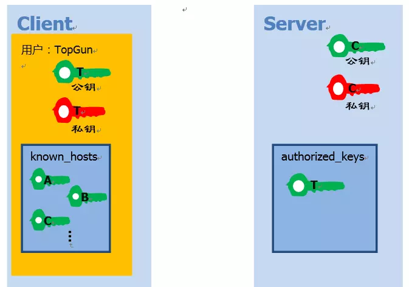

# <font color=#0099ff> **ssh** </font>

> `@think3r` 2019-09-19 00:13:06
> 1. [SSH 基本用法 - zhihu](https://zhuanlan.zhihu.com/p/21999778)
> 2. [Git的.ssh文件夹的内容](https://www.cnblogs.com/zxqblogrecord/p/10123083.html)
> 3. [SSH 密钥类型的的选择（RSA， DSA or Other）](http://blog.sina.com.cn/s/blog_6f31085901015agu.html)
> 4. [图解SSH原理](https://www.jianshu.com/p/33461b619d53)
> 5. [rsa公钥和私钥到底哪个才是用来加密，哪个用来解密？](https://www.cnblogs.com/007sx/p/10987906.html)
> 6. [SSH加密原理、RSA非对称加密算法学习与理解](https://www.cnblogs.com/Alenliu/p/5040062.html)
> 7. [如何用通俗易懂的话来解释非对称加密?](https://www.zhihu.com/question/33645891/answer/814195098)
> 8. [全面认知OpenSSL和OpenSSH](https://blog.csdn.net/zxy355/article/details/89426676)

## <font color=#009A000> 0x00 ssh 基础操作 </font>

### <font color=#FF4500> SSH 是什么 ? </font>

SSH (Secure-Shell) 是一种加密的网络传输协议, 可在不安全的网络中为网络服务提供安全的传输环境.

- SSH 仅仅是一协议标准，其具体的实现有很多，既有开源实现的 OpenSSH，也有商业实现方案。使用范围最广泛的当然是开源实现 OpenSSH。
- PS: 2015 年微软宣布将在未来的操作系统中提供原生 SSH 协议支持, Windows 10 1809 版本一提供可供手动安装的 OpenSSH 工具; 目前, 项目已在 github 开源 : [PowerShell/Win32-OpenSSH](https://github.com/PowerShell/Win32-OpenSSH) ;

### <font color=#FF4500> 为什么需要 SSH？ </font>

SSH 和 telnet、ftp 等协议主要的区别在于安全性。

- ssh 和 `telnet` 等的情况不同，这其密码传输是加密的，因此它不会被偷看到我们的数据连接的人截取。

### <font color=#FF4500> 基础使用 </font>

在 Linux 系统上 SSH 是非常常用的工具，通过 SSH-Client 我们可以连接到运行了 SSH-Server 的远程机器上。SSH-Client 的基本使用方法是: `ssh user@remote -p port`

- `user` 是你在远程机器上的用户名，如果不指定的话默认为当前用户.
- `remote` 是远程机器的地址，可以是 IP，域名，或者是后面会提到的别名.
- `port` 是 SSH-Server 监听的端口，如果不指定的话就为默认值 `22`
  - 知道了上面这三个参数和密码，用任意的 SSH-Client 都能连接上 SSH-Server;
  - 在输入密码的时候，屏幕上不会显示明文密码，也不会显示 ******，这样别人就不会看到你的密码长度了，按下回车即可登入。
- 此处我们看到的是 `ssh` 处理认证的 **缺省** 方式的一个示例。
  - 换句话说，它要求我们输入 `remote` 上的 `user` 这个帐户的密码。如果我们输入我们在 `remote` 上的密码， ssh 就会用安全密码认证协议，把我们的密码传送给 `remote` 进行验证。
  - 但是，和 一旦 `remote` 把我们提供的密码同它的密码数据库相对照进行认证，成功的话，我们就会被允许登录，还会有一个 `remote` 的 `shell` 提示欢迎我们。

## <font color=#009A000> 0x01 ssh 公钥私钥 </font>

每次 ssh 都要输入密码是不是很烦呢？与密码验证相对的，是公钥验证。也就是说，要实现免密码登入. 首先要设置 SSH 钥匙。我们只需要执行这些初始配置步骤一次, 之后的再次认证登陆就毫不费力了。

- `ssh-keygen -t rsa -C "yourname@email.com" -f ~/.ssh/id_rsa`
  - `-f`：指定存放密钥的文件（公钥文件默认和私钥同目录下，不同的是，存放公钥的文件名需要加上后缀.pub）
  - `-C`: comment, 注释, 用于区分当前公钥的用途;
  - `-t` 用来指定密钥类型, 密钥有两种类型 `rsa` 和 `dsa` 两种:
    - RSA 与 DSA 都是非对称加密算法。其中 RSA 的安全性是基于极其困难的大整数的分解（两个素数的乘积）；DSA 的安全性是基于整数有限域离散对数难题。基本上可以认为相同密钥长度的 RSA 算法与 DSA 算法安全性相当。
    - DSA 只能用于数字签名，而无法用于加密（某些扩展可以支持加密）；RSA 即可作为数字签名，也可以作为加密算法。不过作为加密使用的 RSA 有着随密钥长度增加，性能急剧下降的问题。

接下来，我们要让远程机器记住我们的公钥:

- SSH 自带的拷贝命令 : `ssh-copy-id user@remote -p port`
- 手动添加 `ssh user@remote -p port 'mkdir -p .ssh && cat >> .ssh/authorized_keys' < ~/.ssh/id_rsa.pub`
  - 即, 在远端执行新建 `.ssh` 文件夹，并把本地的 `~/.ssh/id_rsa.pub` （也就是公钥）追加到远端的 `.ssh/authorized_keys` 中。

**注意:** <u>要正确理解公钥模式下的认证过程! 首先我们需要了解一些加密学基础知识, 参加下方的知识点.</u>

## <font color=#009A000> 0x02 ssh 文件配置 </font>

### <font color=#FF4500> ssh 别名 `config` </font>

每次都输入 `ssh user@remote -p port`，时间久了也会觉得很麻烦，特别是当 `user`, `remote` 和 `port` 都得输入，而且还不好记忆的时候。配置别名可以让我们进一步偷懒。在 `~/.ssh/config` 里面追加以下内容：

```sh
Host alias
    HostName remote
    User user
    Port port
Host mi6
    HostName 192.168.1.11
    User my_Mi6_userName
    Port 8022
```

- 使用: `ssh alias` 即可;

### <font color=#FF4500> ssh 的 known_host 文件 </font>

`known_host` 文件记录了远程主机 ip 和远程主机对应的公钥指纹，仅在第一次登陆时确认, 后续登陆时, 都直接对比远程主机发过来的公钥指纹和其中对应 ip 的公钥指纹.

`known_hosts` 文件主要是用来进行缓存的，缓存主要是为了减少验证次数，不用每次都验证，直接读取缓存即可。

---

## <font color=#009A000> 0x03 现代加密解密原理 </font>

## <font color=#FF4500> 加密分类 </font>

加密的方式主要有两种：

1. **对称加密**（也称为秘钥加密）
2. **非对称加密**（也称公钥加密）

所谓 <u>对称加密</u> ，指加密解密使用同一套秘钥。

- 但是在实际应用过程中不得不面临一个棘手的问题：如何安全的保存密钥呢？尤其是考虑到数量庞大的 Client 端，很难保证密钥不被泄露。一旦一个 Client 端的密钥被窃据，那么整个系统的安全性也就不复存在。
- 为了解决这个问题，非对称加密应运而生。

---

### <font color=#FF4500> 非对称加密解密的简单例子 </font>

看一个小时候经常在《趣味数学》这类书里的一个数学小魔术：

让对方任意想一个 3 位数，并把这个数和 91 相乘，然后告诉我积的最后三位数，我就可以猜出对方想的是什么数字啦！比如对方想的是 123，那么对方就计算出 123 * 91 等于11193，并把结果的末三位 193 告诉我。看起来，这么做似乎损失了不少信息，让我没法反推出原来的数。不过，我仍然有办法：只需要把对方告诉我的结果再乘以 11，乘积的末三位就是对方刚开始想的数了。

- 可以验证一下，193 * 11 = 2123，末三位正是对方所想的秘密数字！
- 其实道理很简单，91 乘以 11 等于 1001，而任何一个三位数乘以 1001 后，末三位显然都不变（例如 123 乘以 1001 就等于 123123）。

知道原理后，我们可以构造一个定义域和值域更大的加密解密系统。比方说，任意一个数乘以 400000001 后，末 8 位都不变，而 400000001 = 19801 * 20201，于是你来乘以 19801，我来乘以 20201，又一个加密解密不对称的系统就构造好了。

---

### <font color=#FF4500> 非对称加密解密特点 </font>

<u>非对称加密</u> 的核心源于数学问题, 其包含两个不同的密钥：一个是公开的秘钥, 另一个是私有秘钥; 一个可以用作加密, 另一个则用作解密. 两个密钥的特性如下：

- 公钥与私钥是成对出现的；
- 公钥顾名思义就是公开的密钥会发放给多个持有人; 而私钥是私有密码往往只有一个持有人, 必须由用户自行严格秘密保管。
- 公钥和私钥都是密钥，被公开的那个就是公钥，没有被公开的那个就是私钥。
- 密钥越长，越难破解，所以 2048 密钥比 1024 位密钥要更安全；
- 公钥加密后的密文，只能通过对应的私钥进行解密。
- 虽然两个密钥在数学上相关, 但通过公钥推理出私钥的可能性微乎其微。
- RSA 是一种非对称加密算法，它是由三位数学家（Rivest、Shamir、Adleman）设计出来的。

<u>公钥和私钥都可以用于加解密操作</u>，用公钥加密的数据只能由对应的私钥解密，反之亦然。虽说两者都可用于加密，但是不同场景使用不同的密钥来加密，规则如下：

1. **公钥用于加密、私钥用于解密，这才能起到加密作用 :**
   - 因为公钥是公开的，很多人可以持有公钥。若用私钥加密，那所有持有公钥的人都可以进行解密，这是不安全的！
   - 若用公钥加密，那只能由私钥解密，而私钥是私有不公开的，只能由特定的私钥持有人解密，保证的数据的安全性。
   - 即 : 数据的单向流动 ?
2. **私钥用于签名、公钥用于验签 :**
   - 签名和加密作用不同，签名并不是为了保密，而是为了保证这个签名是由特定的某个人签名的，而不是被其它人伪造的签名，所以私钥的私有性就适合用在签名用途上。
   - 私钥签名后，只能由对应的公钥解密，公钥又是公开的（很多人可持有），所以这些人拿着公钥来解密，解密成功后就能判断出是持有私钥的人做的签名，验证了身份合法性。

- 非对称加密在计算上相当复杂, 性能欠佳, 远远不如对称加密; 因此, 在一般实际情况下, 往往由公钥加密来随机创建临时的对称秘钥, 即对话键, 然后才通过对称加密来传输大量, 主体的数据.
- RSA 仅是非对称加密算法的一种，其名字来源于设计它的三位数学家（Rivest、Shamir、Adleman）。

---

### <font color=#FF4500> ssh 免密登录的简要原理  </font>

在 SSH 安全协议的原理中， 运用了非对称加密与对称加密算法的结合. **SSH 数据传输时候基本上所有过程都是使用对称密钥来加密。只有在刚开始创建连接阶段和身份认证握手阶段才使用非对称加密。**

- 其认证过程如下图所示:



**简略的 ssh 认证过程如下:**

1. `Client` 上生成一对公钥和私钥(这对公钥和私钥没必要非得用 `ssh-keygen`, 可以用诸如 `PenguiNet` 之类的工具生成).
2. `Client` 将自己的公钥存放在 `Server` 上，追加在文件 `authorized_keys` 中。
3. `Server` 端接收到 `Client` 的连接请求后，会在 `authorized_keys` 中匹配到 `Client` 的公钥 `pubKey`;并生成随机数 `R`，用 `Client` 的公钥对该随机数进行加密得到 `pubKey(R)`，然后将加密后信息发送给 `Client`。
4. `Client` 端通过私钥进行解密得到随机数 `R`，然后对随机数 `R` 和本次会话的 `SessionKey` 利用 `MD5` 生成摘要 `Digest1` ，发送给 `Server` 端。
5. `Server` 端会也会对 `R` 和 `SessionKey` 利用同样摘要算法生成 `Digest2`。
6. `Server` 端会最后比较 `Digest1` 和 `Digest2` 是否相同，完成认证过程。
   - 需要注意的是：一台主机可能既是 `Client`，也是 `Server`。所以会同时拥有 `authorized_keys` 和 `known_hosts`。
   - <u>永远是 `Client` 连接 `Server` !</u>

---

## <font color=#009A000> 0x04 ssh 协议原理 </font>

> [Linux SSH建立连接过程分析](https://blog.csdn.net/qwertyupoiuytr/article/details/71213463)

SSH 协议框架中, 最主要部分是三个协议:

1. <u>传输层协议 :</u> 提供服务器认证, 数据机密性, 信息完整性等的支持.
2. <u>用户认证协议 :</u> 用户认证协议为服务器提供客户端的身份鉴别.
3. <u>链接协议 :</u>连接协议将加密的信息隧道复用成若干个逻辑通道, 提供给更高层的应用协议使用.

SSH 使用客户端-服务器模型。服务器端需要开启 SSH 守护进程以便接受远端的链接， 而用户需要使用 SSH 客户端与其创建链接。标准端口中的 22 端口被分配给了 SSH 服务。

SSH 提供两种级别的安全验证：

1. 第一种： 基于密码的安全验证。知道账户及密码，即可连接，但是无法避免 “中间人” 攻击。
2. 第二种：基于密钥的安全验证。目前可以通过RSA和DSA两种算法实现数字签名，客户端通过用户名，公钥以及公钥算法等信息来与服务器完成验证。

SSH 建立连接的过程主要分为下面几个阶段：

1. **SSH 协议版本协商阶段:** SSH 目前包括 SSH1 和 SSH2 两个大版本( SSH1 已弃用 )。
   - 客户端通过 TCP 三次握手与服务器的 SSH 端口建立 TCP 连接。
   - 服务器通过建立好的连接向客户端发送一个包含 SSH 版本信息的报文，格式为 `SSH-<SSH协议大版本号>.<SSH协议小版本号>-<软件版本号>`，软件版本号主要用于调试。
   - 客户端收到版本号信息后，如果服务器使用的协议版本号低于自己的，但是客户端能够兼容这个低版本的 SSH 协议，则就使用这个版本进行通信。否则，客户端会使用自己的版本号。
   - 客户端将自己决定使用的版本号发给服务器，服务器判断客户端使用的版本号自己是否支持，从而决定是否能够继续完成 SSH 连接。
   - 如果协商成功，则进入密钥和算法协商阶段。
2. **密钥和算法协商阶段:** SSH 支持多种加密算法，双方根据自己和对端支持的算法进行协商，最终决定要使用的算法。
   - 服务器端和客户端分别发送算法协商报文给对端，报文中 `包含自己支持的公钥算法列表，加密算法列表，MAC（Message Authentication Code，消息验证码）算法列表，压缩算法列表` 等。
   - 和版本协商阶段类似，服务器端和客户端根据自己和对端支持的算法来决定最终要使用的各个算法。
   - <u>服务器端和客户端利用 **`Diffie-Hellman`** 密钥交换算法，主机密钥对等参数，生成 `共享密钥` 和 `会话 ID` 。</u>
        - DH 算法使得每一方能够将他们自己的私有数据与来自另一方的公共数据组合, 以算出 *相同的 `共享会话秘钥`* ;
        - DH 交换算法 **仅** 用于客户端和服务器会话密钥和会话 ID 的交换，并不用于消息的加密;
        - DH 交换算法的特性使得第三方很难获取到会话密钥和会话 ID ;
        - 注意: `共享秘钥` 会加密此后的所有通信! (`会话密钥` 用于在后续的通信过程中两端对传输的数据进行加密和解密); 而 `共享秘钥` 是对称秘钥, 所以双方都可以加解密消息, 该过程保证了, 随后的数据通信位于一个加密隧道中.
        - 而 `会话 ID` 用于认证过程;
3. **认证阶段 :** 服务器对客户端进行身份验证(用户验证和访问权限确定)。
   1. 用户密码:
       - 只知道此 host 的公钥指纹，还继续连接吗？
       - 我们输入 yes 之后，服务器将其公钥发送给客户端，客户端将公钥保存在 `/home/xxx/.ssh/known_hosts` 里，后续再也不会看到输入 `yes/no` 的这一步。
       - 到这里，服务器请求客户端输入密码，客户端获取用户输入的密码后使用服务器的公钥进行加密并发送给服务器，服务器使用自己的私钥进行解密. (所有的会话都会再经过第二阶段产生的会话密钥进行加密，所以传输是相当安全的。)
         - 对比密码是否是该用户的密码，如是则允许登陆，接收客户端用户发送的指令，
         - 如否则返回验证失败，拒绝登陆。当然指令也是经过公钥加密的，
   2. 使用公钥认证（免密码登陆）:
      - 这一步在我们手动将客户端的公钥复制到服务器的 `authorized_keys` 文件中后才能实现。相当于服务器获取了客户端的公钥。那么不需要密码便可登陆，这一步是如何实现的呢 ?
      - 客户端首先向服务端发送要对其进行身份验证的秘钥对的用户名;
      - 服务器会检查客户端尝试登陆用户账户下的 `authorized_keys` 文件;
      - 如果再文件中找到具有匹配的公钥, 则服务端用客户端的公钥加密一个 256 位的随机字符串, 并发送给客户端.
      - 客户端接收后使用自己的私钥解密(如果可以的话)，然后将这个字符串和 `会话 id` 合并在一起，对结果应用 MD5 散列函数并把散列值返回给服务器，作为回应;
      - 服务器进行相同的 MD5 散列函数处理，如果客户端和该值可以匹配，那么认证成功，允许登陆，达到免密登陆的效果。 (如果两个值匹配, 则证明客户端拥有私钥, 并且认证通过)
4. 会话请求阶段，完成认证后，客户端会向服务器端发送会话请求。
5. 交互会话阶段，会话请求通过后，服务器端和客户端进行信息的交互。

如果利用 ssh 协议进行远程登录时是第一次登录到对方的主机上，会提示一个 “指纹” 验证信息在终端上，让你输入 `yes/no` 继续下一步。

- 这个指纹就是对方主机的 `/etc/ssh/ssh_host*key.pub` 中的公钥信息进行了sha256 算法和 MD5 算法单向散列之后的值，可以被看做是对方主机的唯一标识。
- 这个主要的目的就是为了确认要连接的 IP 的主机是否是真正你想要连接的 IP 的主机（中途可能被截获此连接请求），从而保证连接无误，增强安全性不会连接到***的主机上去。
- 第一次 ssh 连接成功之后，本机就会把对方主机的公钥信息（注意是公钥信息不是指纹信息）存储到本地的 `~./ssh/know_hosts` 文件中(如果没有这个文件会自动生成），等到下次再次连接相同 IP 的对方主机时，便会计算并将指纹信息自动进行比对（此时也就不会再出现询问 yes/no 的选项了）。此时如果指纹比对相同一致会进行下一步的验证，如果不同则 ssh 协议认为对方主机被更换，便会自动断开连接请求拒绝连接，以实现安全连接的目的。
- 如果对方重装了系统需要再次连接则可以把 know_hosts 中相对应的 IP 和公钥给删除掉即可，下次就会重新再次询问 `yes/no` 并下载对方的公钥信息了

总结下:

- 公钥加密, 私钥解密;
- 客户端用来加密*密钥和算法协商阶段* 的 `共享密钥` 和 `会话 ID` ;
- 首次认证时, 服务器发送公钥至客户端,

### <font color=#FF4500> ssh 中间人攻击 </font>

> [ssh协议的原理，你有可能还不知道](https://blog.csdn.net/somezz/article/details/82141552)

中间人攻击：如果攻击者插在用户与远程主机之间（比如在公共的 wifi 区域），用伪造的公钥，获取用户的登录密码。再用这个密码登录远程主机，那么 SSH 的安全机制就荡然无存了。这种风险就是著名的中间人攻击.

那么，ssh 是如何应对中间人攻击的?

- 一开始我以为是 DH 密钥交换算法可有效防止第三人获取会话密钥，但这并不能阻止中间人伪装成服务器。
- 虽然 SSH 从原理上不能抵御中间人攻击，但 SSH 首次连接会下载服务端的公钥，并提示服务器的公钥指纹，用户可以核对此指纹与服务器公钥生成的指纹是否一致，一致则保存并信任，下次访问时客户端将会核对服务端发来的公钥和本地保存的是否相同，不同就发出中间人攻击的警告拒绝连接，除非用户手动清除已保存的公钥。
- 结论：如果首次连接没有中间人，之后的连接就无需担心中间人，因为中间人给出的公钥和服务端给出的公钥相同的可能性可以忽略。

## <font color=#009A000> 0x05 交叉编译 openSSH </font>

> [交叉编译openssl/curl支持SSL功能](https://blog.csdn.net/king_jie0210/article/details/82897759)

1. 下载需要的源码
    - zlib-1.2.3.tar.gz          http://www.zlib.net
    - openssl-1.0.1h.tar.gz      http://www.openssl.org/source/
    - openssh-5.5p1.tar.gz       http://mirror.aarnet.edu.au/pub/OpenBSD/OpenSSH/portable/

2. 解压 && mkdir install-dir;

3. 编译 zlib;

    ``` sh
    # 生成 Makefile, zlib 的 configure 参数较少, 自己手动修改吧
    ./configure

    # 修改 Makefile
    CC=gcc
    LDSHARED=gcc -shared -Wl,-soname,libz.so.1,--version-script,zlib.map
    CPP=gcc -E
    AR=ar
    prefix =/usr/local

    # 编译
    make && make install
    ```

4. 编译 openssl

    ``` sh
    # no-asm 是在交叉编译过程中不使用汇编代码代码加速编译过程.原因是它的汇编代码是对arm格式不支持的
    ./Configure --prefix=/home/think3r/github/openSSH/openssl-install --cross-compile-prefix=arm-linux- no-asm shared linux-generic32

    make -j && make install
    ```

5. 编译 openSSH

    ```sh
    ./configure -static --host=arm-linux --with-libs --with-zlib=/home/think3r/github/openSSH/zlib-install --with-ssl-dir=/home/think3r/github/openSSH/openssl-install CC=arm-linux-gcc AR=arm-linux-ar --prefix=/home/think3r/github/openSSH/openssh-install --disable-strip

    make -j && make install
    ```
